# tinyjs examples

Example apps for **[tinyjs](https://tinyjs.app)** — tiny (~6 MB) macOS desktop
apps built from a txiki.js backend and a native WebKit window.

## Getting started

1. Head to **[tinyjs.app](https://tinyjs.app)** and install the `tinyjs` CLI.
2. Clone this repo.
3. Pick an example, `cd` into it, and run it:

   ```sh
   cd kitchen-sink
   tinyjs dev      # run with hot reload
   tinyjs build    # produce dist/<Name>.app + a single binary
   ```

Each example is a self-contained project with its own `tinyjs.json`,
`src/main.js` (backend), and `src/frontend/` (the page).

No toolchain? Every example has a **prebuilt, signed & notarized `.dmg`**
below — and check the sizes: real native apps at **4–5 MB each**. Click to
download, open, drag to Applications. The full story on each app lives in
its own README.

## Examples

### **[shelf](shelf/)**

#### An app store for this repo


Every example below on wooden shelves (pine by day, walnut by night) — daily drivers, UX experiments, toys, and API showcases — with one-click install, update, and uninstall. The catalog updates itself from this repo, and the Installed tab is your fleet as icons on a shelf.

**⬇ Download:** [shelf-0.2.2.dmg](https://github.com/tarwin/tinyjsapp-examples/raw/main/_builds/shelf-0.2.2.dmg) **(4.6 MB)** — signed & notarized.

### **[kitchen-sink](kitchen-sink/)**

#### Tiny Deck — the whole tinyjs API on one deck

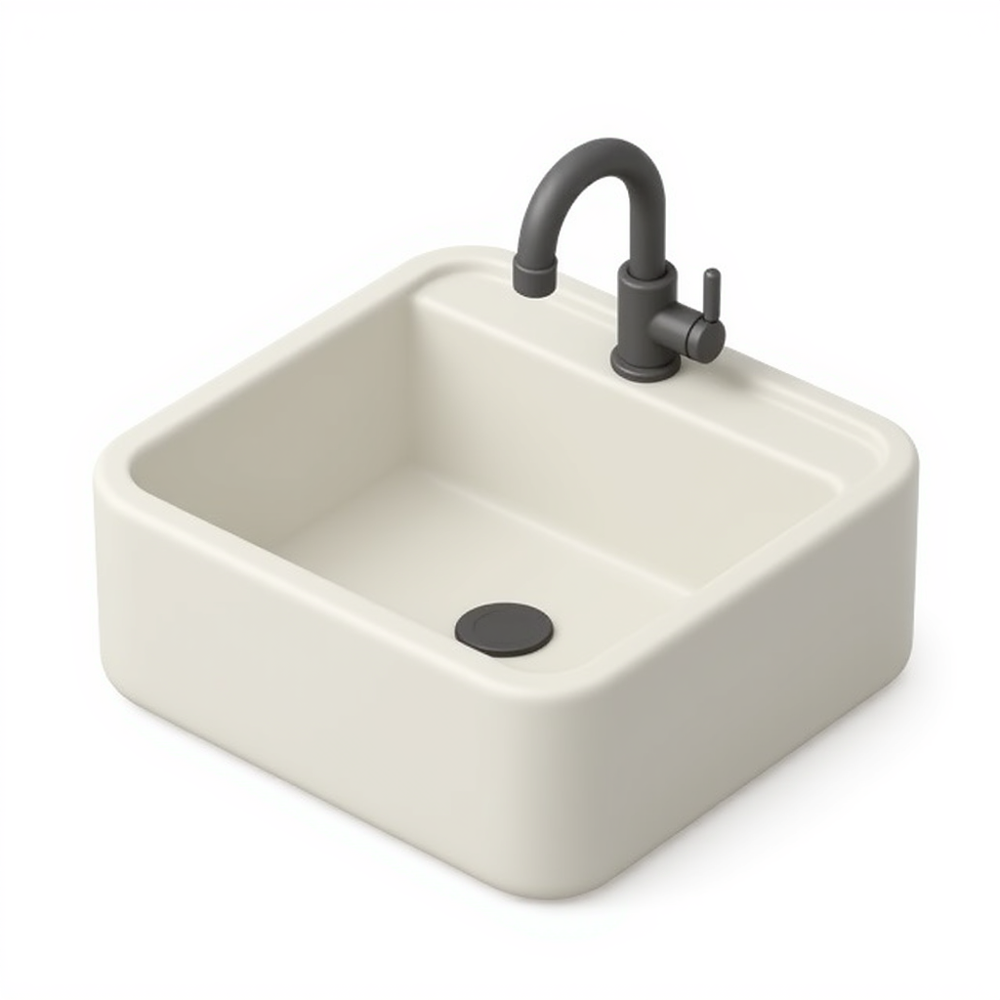


Thirteen tabs of live demos: shell, files, HTTP, GPU, WASM, FFI, windows, tray, hotkeys, share sheets, screenshots, battery, haptics, Spotlight, and more.

**⬇ Download:** [kitchen-sink-0.15.1.dmg](https://github.com/tarwin/tinyjsapp-examples/raw/main/_builds/kitchen-sink-0.15.1.dmg) **(4.5 MB)** — signed & notarized.

### **[tinyslaq](tinyslaq/)**

#### A Slack-style chat clone


Workspaces, channels, and DMs in SQLite — with canned auto-replies and desktop notifications from the channel you're not looking at.

**⬇ Download:** [tinyslaq-0.1.2.dmg](https://github.com/tarwin/tinyjsapp-examples/raw/main/_builds/tinyslaq-0.1.2.dmg) **(4.7 MB)** — signed & notarized.

### **[matcha](matcha/)**

#### Keep your Mac awake, from the menu bar

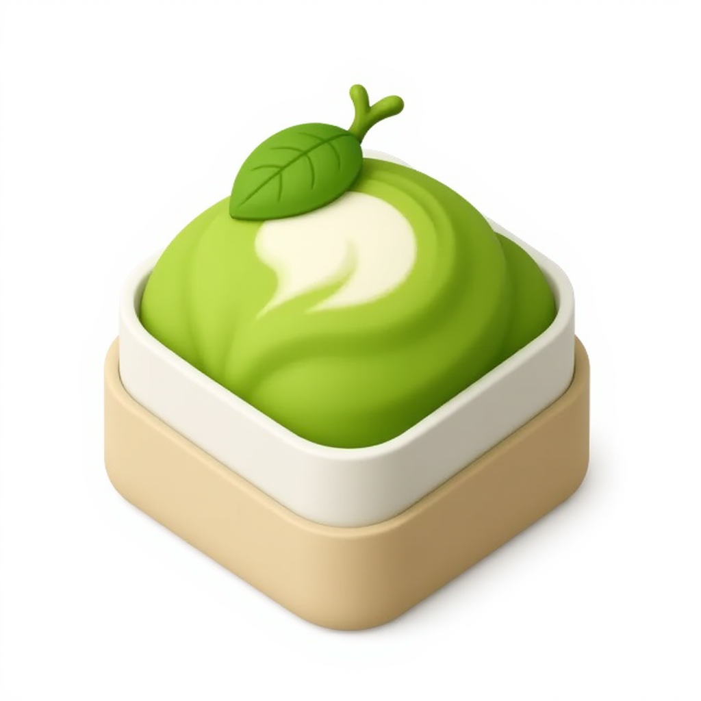


Left-click the cup to toggle `caffeinate`, right-click for timed sessions. The canonical tinyjs tray-app recipe.

**⬇ Download:** [matcha-0.1.2.dmg](https://github.com/tarwin/tinyjsapp-examples/raw/main/_builds/matcha-0.1.2.dmg) **(4.6 MB)** — signed & notarized.

### **[tomato](tomato/)**

#### A silly, tomato-shaped Pomodoro timer

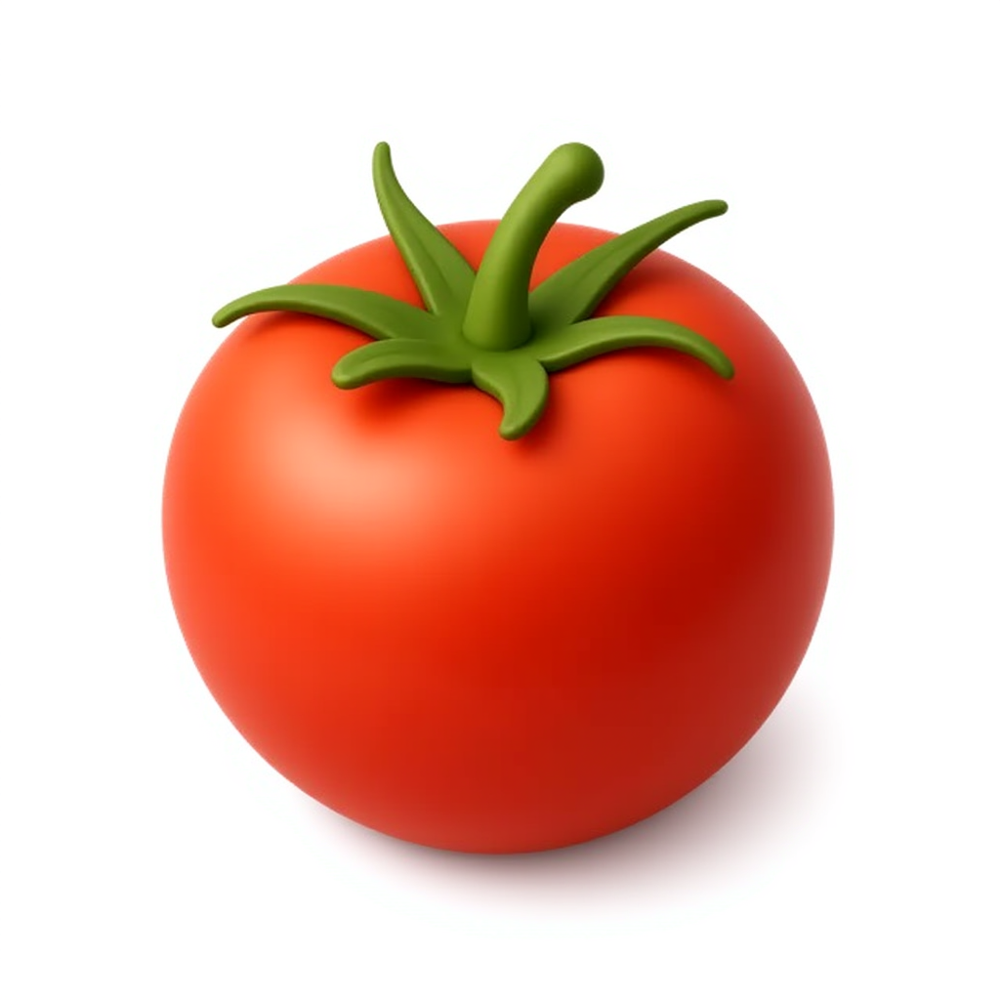


A googly-eyed tomato floats on your desktop (transparent, frameless) while the countdown ticks in the menu bar.

**⬇ Download:** [tomato-0.1.1.dmg](https://github.com/tarwin/tinyjsapp-examples/raw/main/_builds/tomato-0.1.1.dmg) **(4.5 MB)** — signed & notarized.

### **[worldclock](worldclock/)**

#### A menu-bar world clock

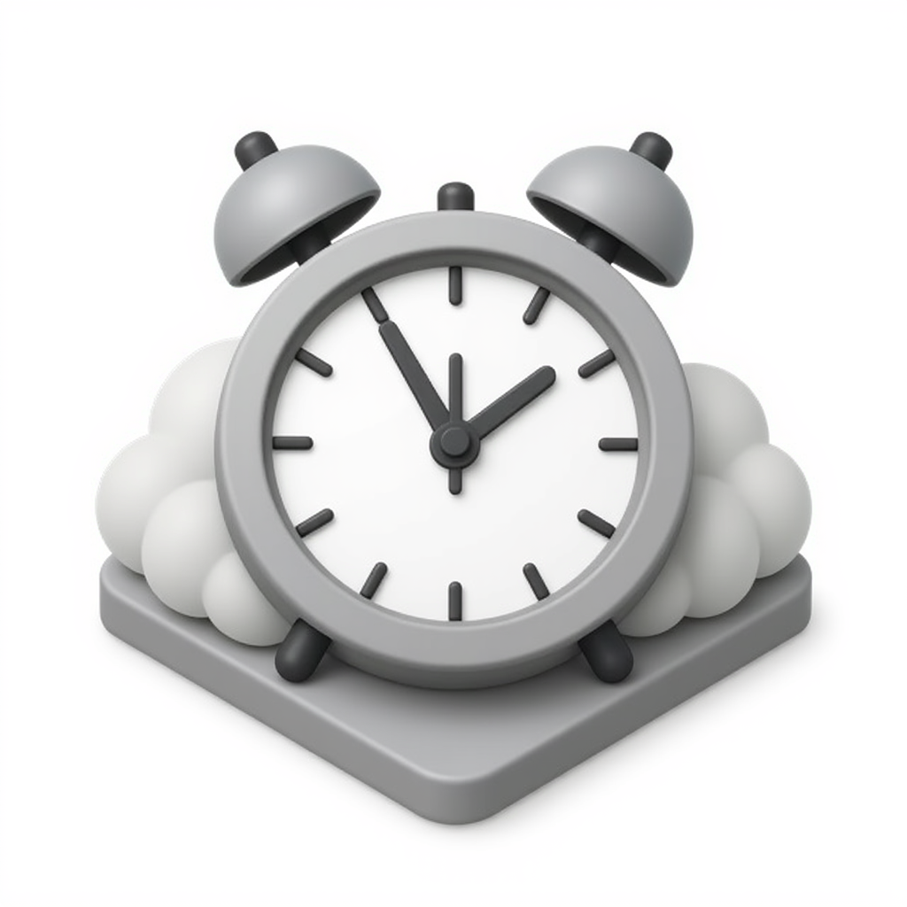


Your home city lives in the menu bar as an emoji — "🌉 4:45p" — with optional cycling through the rest; click for a frosted popover dropping right from the tray icon, with every city, day offsets, day/night dots, add-your-own cities (emoji included), and an open-at-login toggle.

**⬇ Download:** [worldclock-0.3.0.dmg](https://github.com/tarwin/tinyjsapp-examples/raw/main/_builds/worldclock-0.3.0.dmg) **(4.7 MB)** — signed & notarized.

### **[lumber](lumber/)**

#### A log-tailing HUD

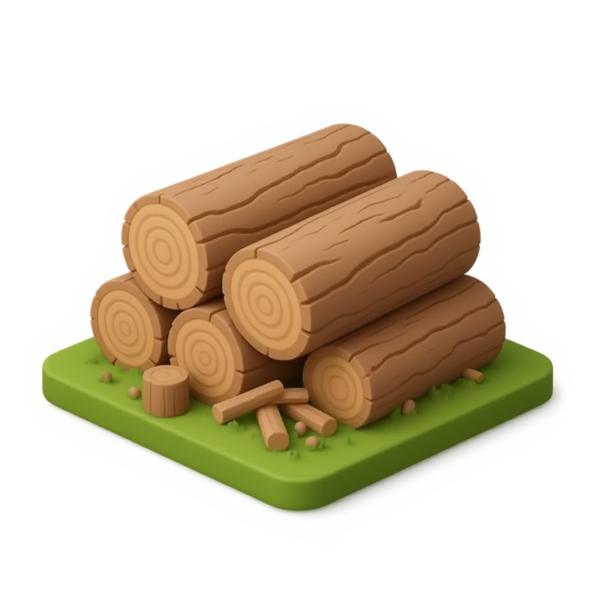


Drop a log file and a translucent always-on-top panel live-follows the tail — filters, error colorizing, `tail -f` smarts.

**⬇ Download:** [lumber-0.1.1.dmg](https://github.com/tarwin/tinyjsapp-examples/raw/main/_builds/lumber-0.1.1.dmg) **(4.7 MB)** — signed & notarized.

### **[boo](boo/)**

#### A shy little desktop ghost


It wanders your screen and flees your cursor. Offer cookies, earn its trust, and it follows you around like a puppy.

**⬇ Download:** [boo-0.1.1.dmg](https://github.com/tarwin/tinyjsapp-examples/raw/main/_builds/boo-0.1.1.dmg) **(4.3 MB)** — signed & notarized.

### **[kraa](kraa/)**

#### Two ravens loose on your desktop


They strut, peck, caw at each other, and fly off when you get too close. Scatter seed (⌃⌥S) and win them over.

**⬇ Download:** [kraa-0.1.1.dmg](https://github.com/tarwin/tinyjsapp-examples/raw/main/_builds/kraa-0.1.1.dmg) **(4.5 MB)** — signed & notarized.

### **[kraa3d](kraa3d/)**

#### kraa's ravens, reincarnated as skinned 3D crows

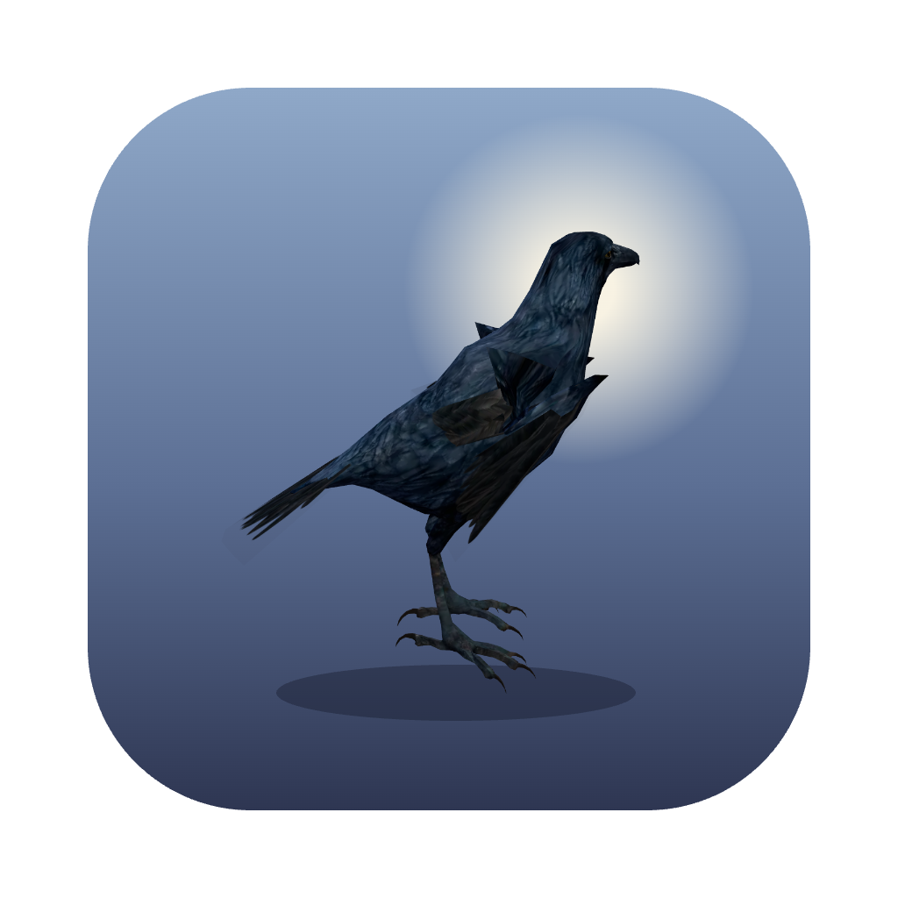

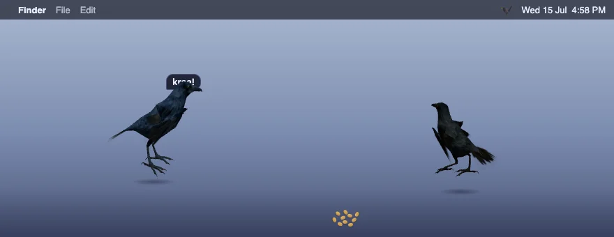

The same two birds as rigged, animated 3D models on transparent windows — they walk, flap, glide, and kraa in stereo.

**⬇ Download:** [kraa3d-0.2.0.dmg](https://github.com/tarwin/tinyjsapp-examples/raw/main/_builds/kraa3d-0.2.0.dmg) **(5.0 MB)** — signed & notarized.

### **[coo3d](coo3d/)**

#### A flock of 3D pigeons loose on your desktop


Two to twenty pigeons that strut, mob crumbs, loaf on screen edges, and poop. Very occasionally one hatches gold.

**⬇ Download:** [coo3d-0.2.0.dmg](https://github.com/tarwin/tinyjsapp-examples/raw/main/_builds/coo3d-0.2.0.dmg) **(5.4 MB)** — signed & notarized.

### **[treez](treez/)**

#### Magik Treez™ — car air fresheners for your desktop

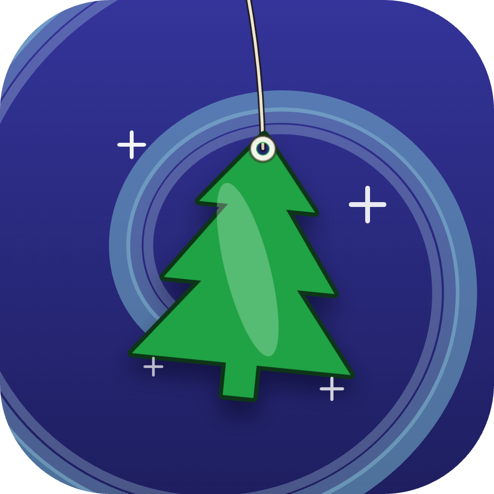

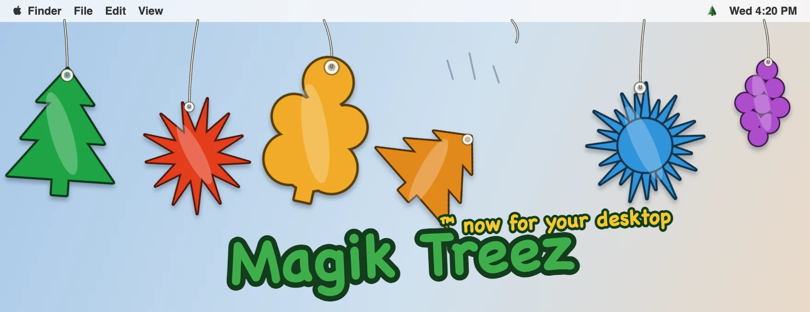

A family of them sways on strings from the top of your screen. Drag them around — pull down too far and the string *snaps*.

**⬇ Download:** [treez-0.1.1.dmg](https://github.com/tarwin/tinyjsapp-examples/raw/main/_builds/treez-0.1.1.dmg) **(4.2 MB)** — signed & notarized.

### **[nib](nib/)**

#### A tiny Markdown editor — one window per document

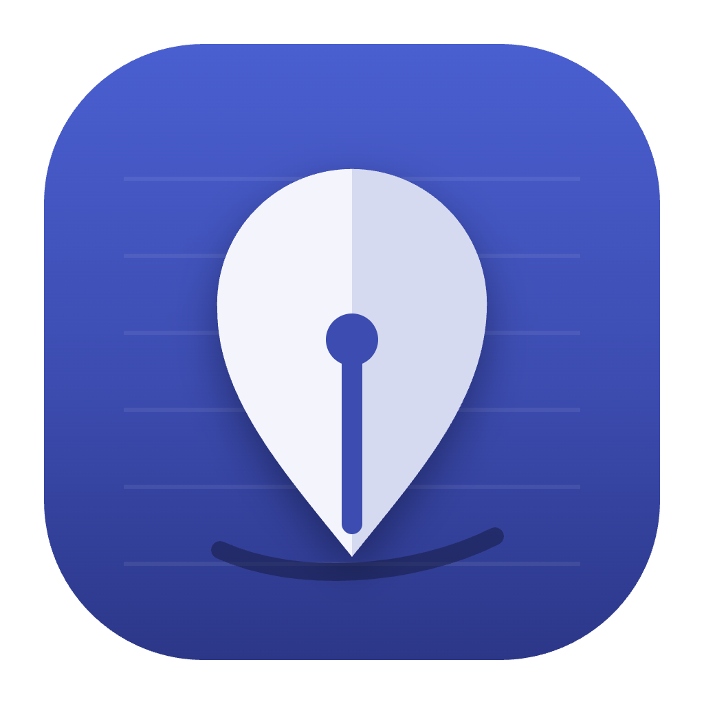


Editor/preview split, clickable task boxes, themed PDF and HTML export, lossless closing. Double-click any `.md` in Finder.

**⬇ Download:** [nib-0.1.2.dmg](https://github.com/tarwin/tinyjsapp-examples/raw/main/_builds/nib-0.1.2.dmg) **(4.3 MB)** — signed & notarized.

### **[pasta](pasta/)**

#### Clipboard history in the menu bar

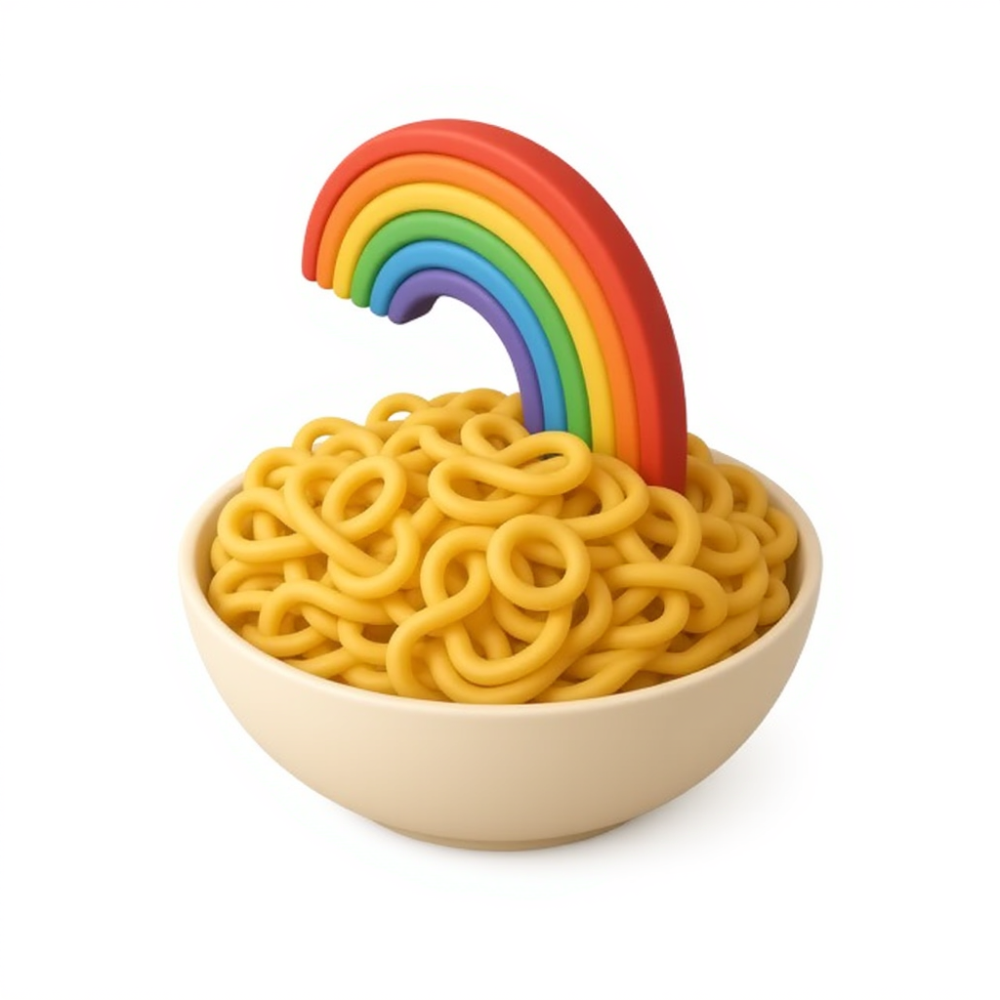


Text, images, files, and colors — ⌘⇧V summons the palette, ⏎ pastes a clip back as whatever it was.

**⬇ Download:** [pasta-0.5.2.dmg](https://github.com/tarwin/tinyjsapp-examples/raw/main/_builds/pasta-0.5.2.dmg) **(4.6 MB)** — signed & notarized.

### **[presto](presto/)**

#### Drop a file, ✨ it's converted

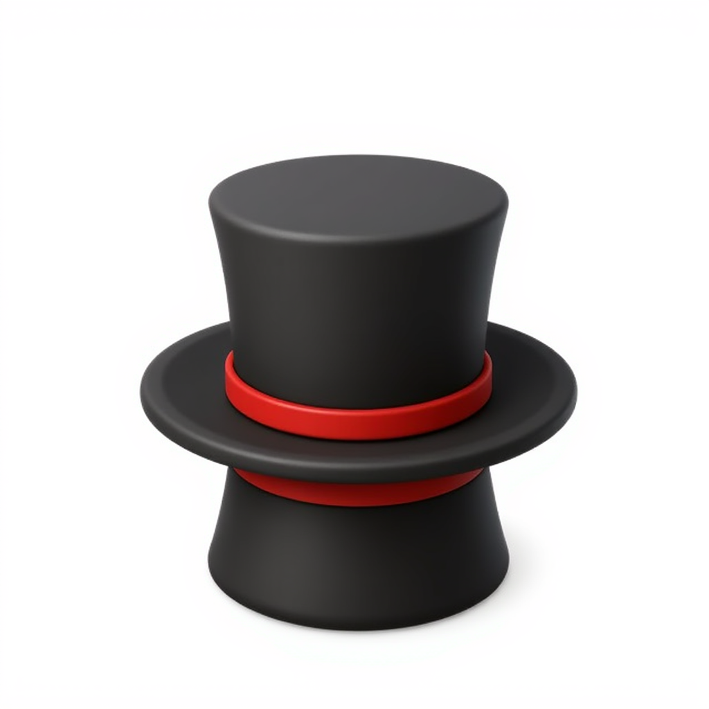


Images and video convert on drop (window or Dock icon), with a live progress bar and outputs next to the source.

**⬇ Download:** [presto-0.1.2.dmg](https://github.com/tarwin/tinyjsapp-examples/raw/main/_builds/presto-0.1.2.dmg) **(4.3 MB)** — signed & notarized.

### **[cheese](cheese/)**

#### A photo booth

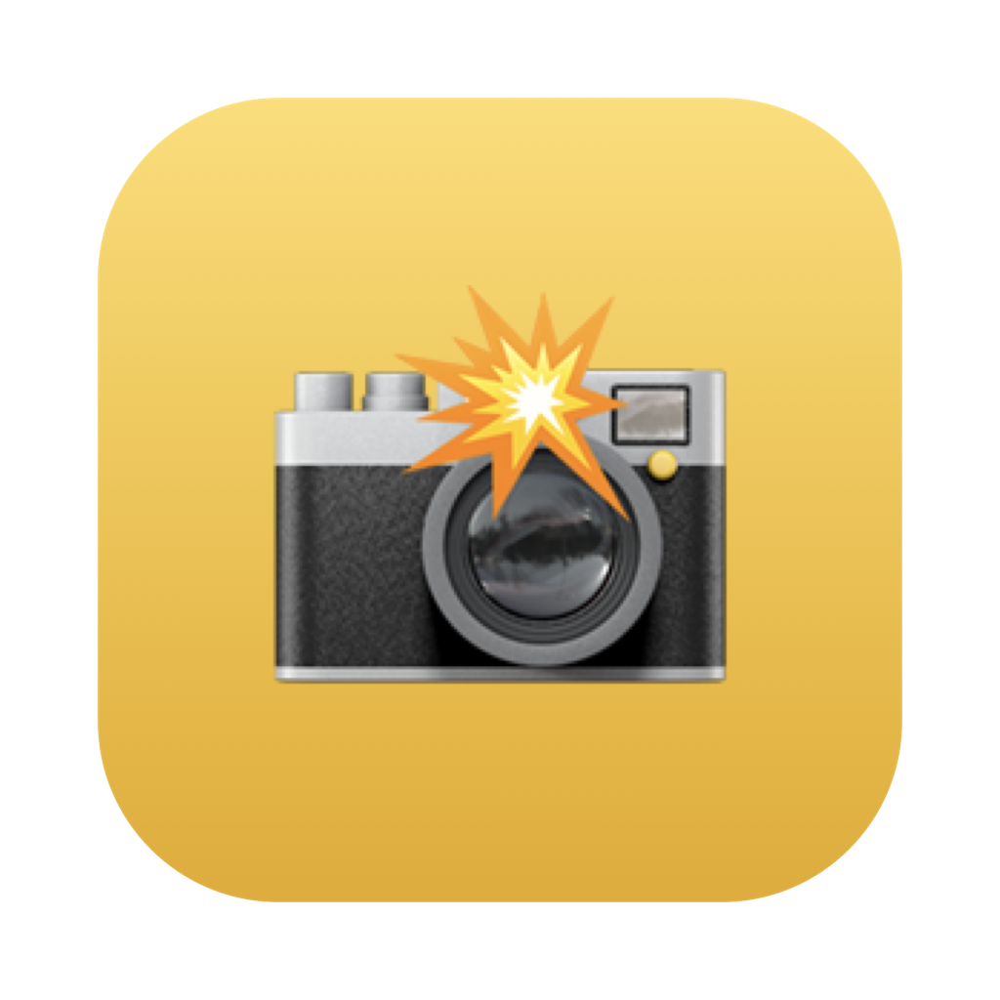

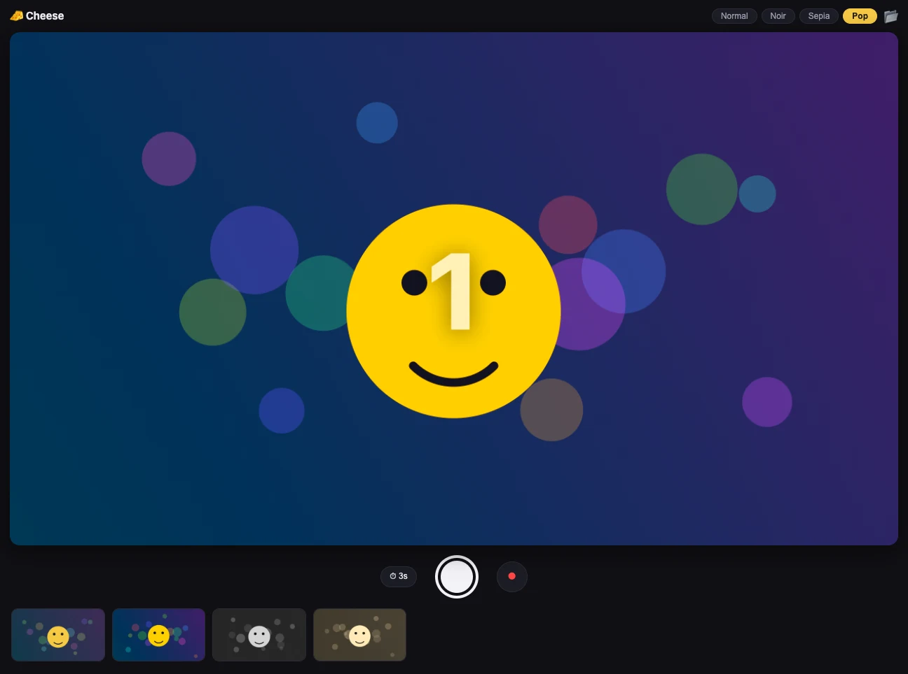

Countdown snaps with baked-in filters, video clips with a live mic meter — every shot a real file that drags out of the app.

**⬇ Download:** [cheese-0.1.2.dmg](https://github.com/tarwin/tinyjsapp-examples/raw/main/_builds/cheese-0.1.2.dmg) **(4.3 MB)** — signed & notarized.

### **[deja](deja/)**

#### Your workday on a scrub bar


A screenshot every 30 seconds, all day, played back like a flipbook — scrubber, day sidebar, drag any frame out.

**⬇ Download:** [deja-0.1.2.dmg](https://github.com/tarwin/tinyjsapp-examples/raw/main/_builds/deja-0.1.2.dmg) **(4.1 MB)** — signed & notarized.

### **[hush](hush/)**

#### A secret keeper behind Touch ID


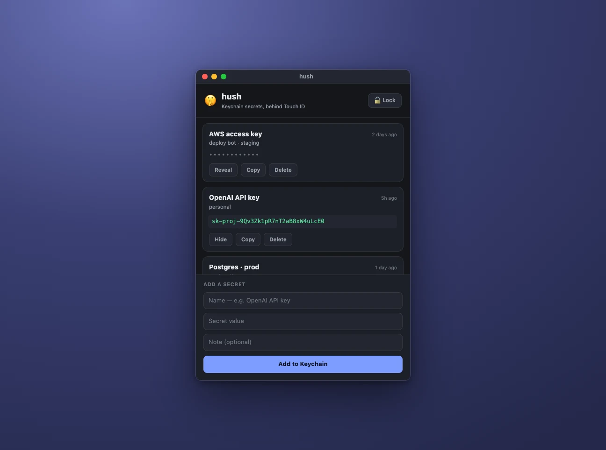

Secrets live in the real macOS Keychain; every reveal and copy goes through the Touch ID sheet. Copies self-wipe in 30 s.

**⬇ Download:** [hush-0.1.2.dmg](https://github.com/tarwin/tinyjsapp-examples/raw/main/_builds/hush-0.1.2.dmg) **(4.2 MB)** — signed & notarized.

### **[procsy](procsy/)**

#### A process & open-port inspector


Live `ps` and `lsof` tables with sorting, filtering, and kill buttons — built in React 19 + Radix + TypeScript.

**⬇ Download:** [procsy-0.1.2.dmg](https://github.com/tarwin/tinyjsapp-examples/raw/main/_builds/procsy-0.1.2.dmg) **(4.8 MB)** — signed & notarized.

### **[sqlittle](sqlittle/)**

#### A little SQLite browser

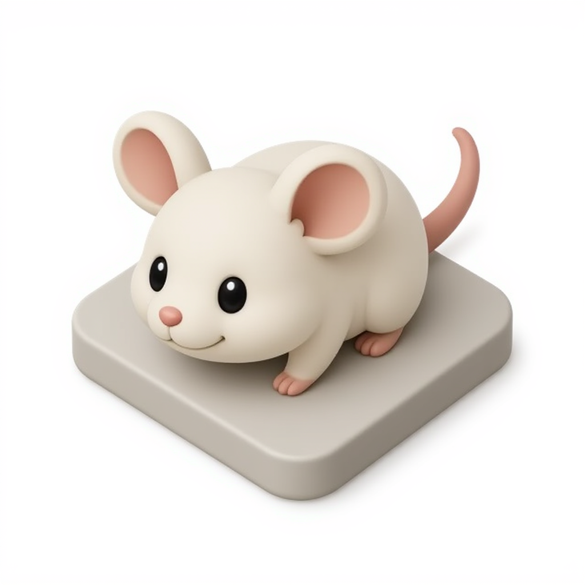


Double-click a `.db` in Finder and browse it — tables, lazy pagination, a ⌘↩ query box. Vue 3 + PrimeVue.

**⬇ Download:** [sqlittle-0.1.2.dmg](https://github.com/tarwin/tinyjsapp-examples/raw/main/_builds/sqlittle-0.1.2.dmg) **(5.0 MB)** — signed & notarized.

### **[trolley](trolley/)**

#### A tiny Trello, all local


Boards, drag-and-drop cards, due dates in the menu bar, a ⌃⌥T quick-add palette — plus the documented auto-update recipe.

**⬇ Download:** [trolley-0.1.2.dmg](https://github.com/tarwin/tinyjsapp-examples/raw/main/_builds/trolley-0.1.2.dmg) **(4.6 MB)** — signed & notarized.

### **[beam](beam/)**

#### A Raycast-lite launcher

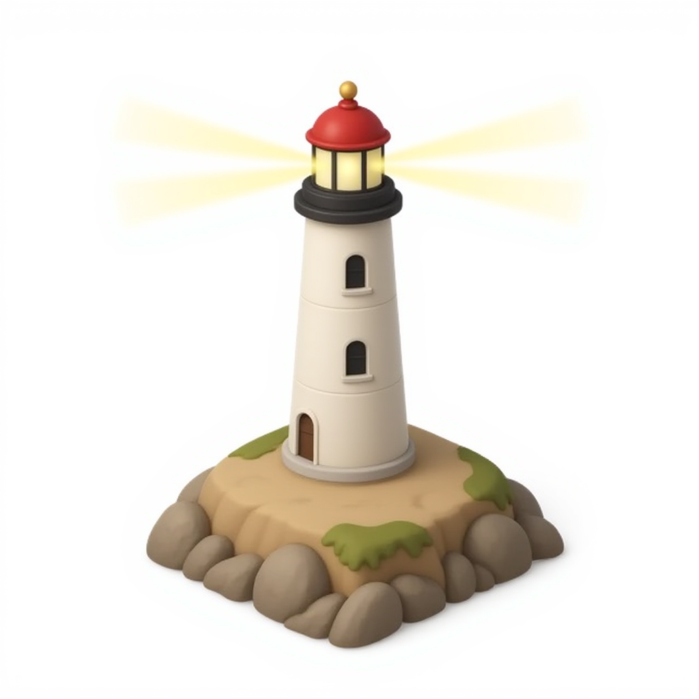


⌥Space anywhere: fuzzy-launch apps (real icons), find files through Spotlight, or type math and copy the answer.

**⬇ Download:** [beam-0.1.2.dmg](https://github.com/tarwin/tinyjsapp-examples/raw/main/_builds/beam-0.1.2.dmg) **(4.5 MB)** — signed & notarized.

### **[amp](amp/)**

#### A Winamp for the desktop — four real windows


Player, playlist, 10-band EQ with [AutoEq](https://github.com/jaakkopasanen/AutoEq) headphone correction, a full **podcast deck** (shelf, offline downloads, resume, show notes), and **six visualizer engines** — real Milkdrop, [Geiss HDR](https://www.geisswerks.com/geiss_hdr/), and four homegrown WebGPU + HDR pieces: Magnetosphere, a fish-stirred liquid Lagoon, a starling Murmuration, and a Bravia-style Ballroom — each pane a native window that snaps, docks, and windowshades. **BIG** swaps it all for a fullscreen 80s hi-fi stack: VU needles, LED spectrum, giant thumping speakers, a zoomable world-radio globe with real country borders, and podcast covers leaning against the gear like LP sleeves — in brushed silver when your Mac runs light.

**⬇ Download:** [amp-0.6.0.dmg](https://github.com/tarwin/tinyjsapp-examples/raw/main/_builds/amp-0.6.0.dmg) **(4.6 MB)** — signed & notarized.

### **[platter](platter/)**

#### A record player, not a music player


Your music folder becomes a crate of LPs, and the only way to hear one is the ritual: pull the sleeve, slide the record onto a three.js turntable, start the motor, and set the tonearm down by hand — the pitch bends up as the platter comes to speed. No skip button, no queue. Landing between tracks takes a steady hand (an amber ring previews the drop, and the stylus leans toward track starts), sides run out into a crackling lead-out groove, and flipping to side two means pulling the record out toward you and turning it over — motor stopped first. Missing sleeves get found online (Cover Art Archive fronts *and backs* — click the sleeve to turn it over), the room does time-of-day lighting with a lamp, curtains, and a regrettable disco switch (real mirrorball, gobo light), and **Spotify Connect** puts your saved albums in the crate: platter is the turntable, Spotify is the amplifier. Dress the deck in the shop — painted or wood bases, colored felt or acrylic platters, or a full SL-1200 homage. 45 rpm switch included for chipmunk emergencies.

**⬇ Download:** [platter-0.1.0.dmg](https://github.com/tarwin/tinyjsapp-examples/raw/main/_builds/platter-0.1.0.dmg) **(5.6 MB)** — signed & notarized.

### **[till](till/)**

#### A menu-bar time tracker — a local homage to Harvest


The running timer lives in the menu bar; the popover drops from it, tears off into a real window, and snaps back home.

**⬇ Download:** [till-0.1.2.dmg](https://github.com/tarwin/tinyjsapp-examples/raw/main/_builds/till-0.1.2.dmg) **(4.0 MB)** — signed & notarized.
