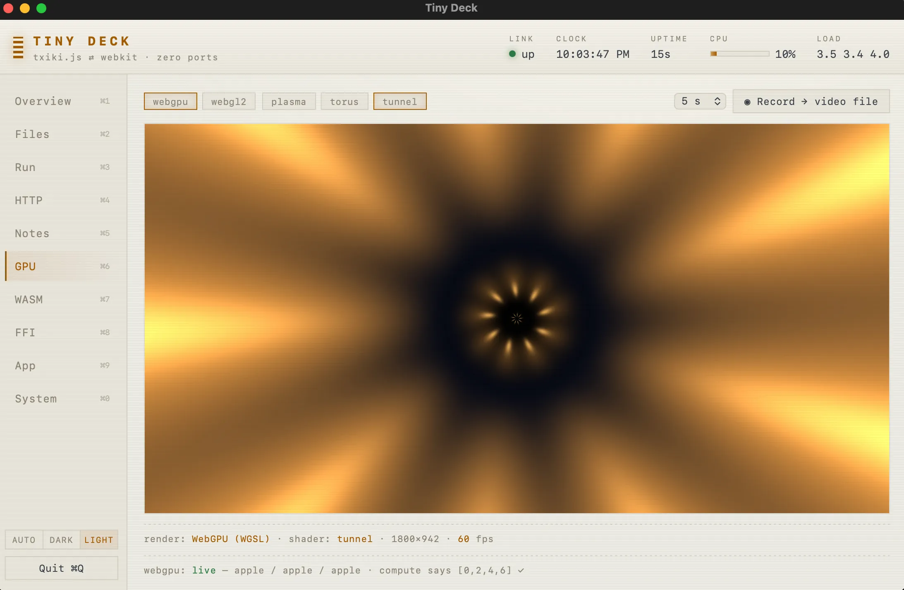
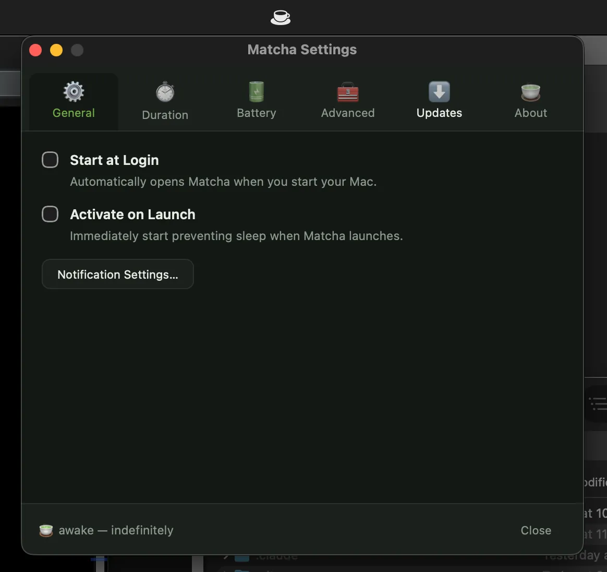
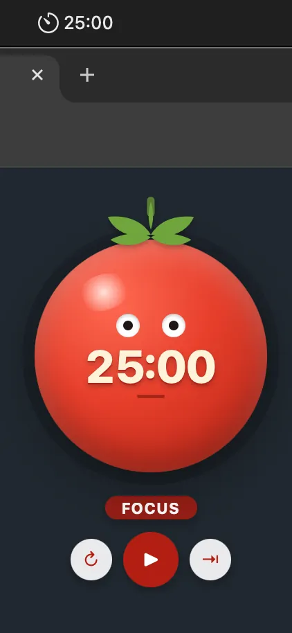
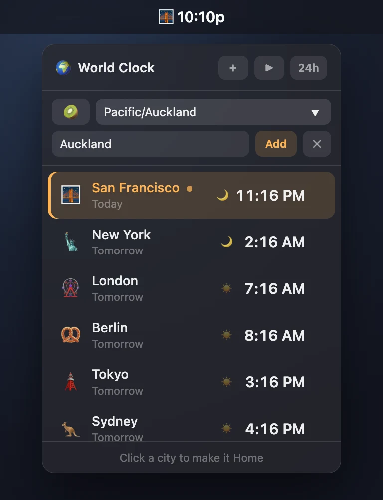
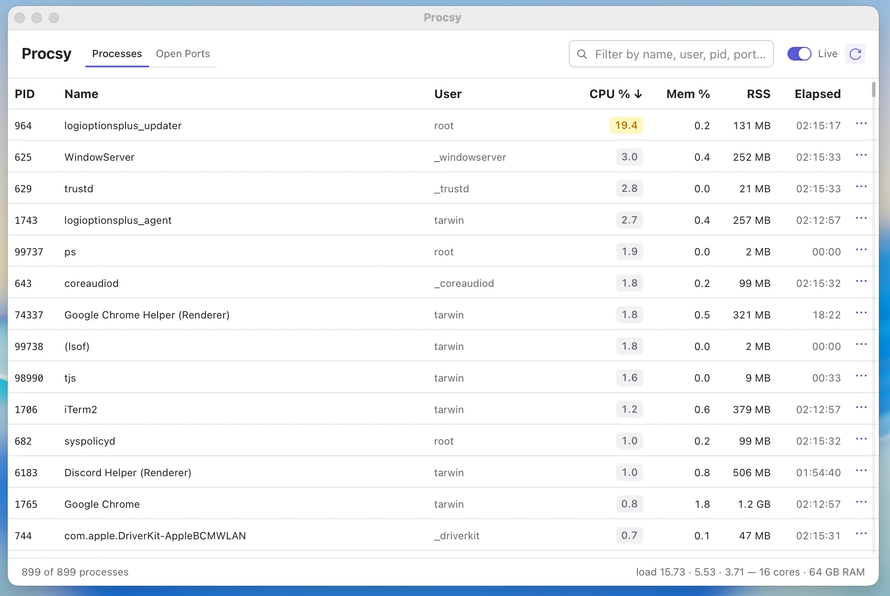
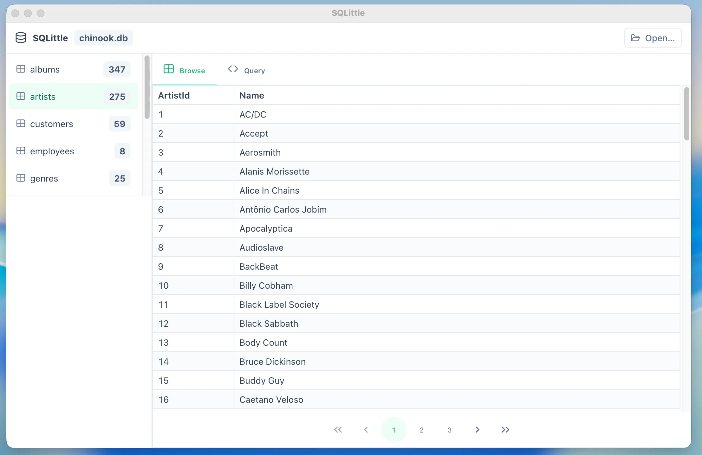

# tinyjs examples

Example apps for **[tinyjs](https://tinyjs.app)** — tiny (~6 MB) macOS desktop
apps built from a txiki.js backend and a native WebKit window.

## Getting started

1. Head to **[tinyjs.app](https://tinyjs.app)** and install the `tinyjs` CLI.
2. Clone this repo.
3. Pick an example, `cd` into it, and run it:

   ```sh
   cd kitchen-sink
   tinyjs dev      # run with hot reload
   tinyjs build    # produce dist/<Name>.app + a single binary
   ```

Each example is a self-contained project with its own `tinyjs.json`,
`src/main.js` (backend), and `src/frontend/` (the page).

## Examples

- **[kitchen-sink](kitchen-sink/)** — "Tiny Deck", a command deck that shows off
  the tinyjs API surface: running shell commands from the page, native
  notifications, tray mode, global hotkeys, window/menu control, file dialogs,
  frameless chrome, and a second native window (the Inspector) sharing one
  backend.

  
- **[matcha](matcha/)** — a menu-bar app that toggles macOS `caffeinate` on and
  off to keep your Mac awake. Left-click toggles, right-click opens a stateful
  menu (live status + "Activate for" duration submenu that auto-stops).
  Launches as a menu-bar agent (0.9.0 `"activation": "accessory"` — no Dock
  icon, no window flash) with an SF Symbol cup icon, and opens two fixed-size
  windows on demand (0.8.0 multi-window): a little About popover and a tabbed
  Settings window (General / Duration / Battery / Advanced / Updates / About)
  persisted with `tiny.store`. The canonical tinyjs *tray app* recipe.

  
- **[tomato](tomato/)** — a silly, tomato-shaped Pomodoro timer. The window is
  **transparent and frameless** (0.9.0 `"chrome"`) so it floats on the desktop
  as a round googly-eyed tomato — no square edges. The countdown ticks live in
  the **menu-bar title** (`tray.set` every second), pausing swaps Pause↔Resume
  **in place** (`menu.update`, no full repaint), and a phase-end **notification
  pops the tomato back up when clicked** (`onNotificationClick`). Launches as a
  menu-bar agent (`"activation": "accessory"`). The canonical *transparent
  window* + live-tray recipe.

  
- **[worldclock](worldclock/)** — a menu-bar world clock. The tray title
  **cycles through cities** every few seconds (`tray.set` each tick —
  "Tokyo 4:45p" → "London 8:45p" → …), and a left-click drops a small
  **vibrancy panel** (0.9.0 `"chrome": { "vibrancy": "popover" }`) just under
  the menu bar that lists every city's live time, day offset, and a day/night
  dot. It **dismisses itself on focus loss** like a real popover (the page's
  `window` blur). Neat wrinkle: txiki.js has no `Intl`, so the WebKit page
  computes each zone's DST-correct UTC offset and hands the backend a table —
  frontend knows the zones, backend owns the tick. Launches as a menu-bar
  agent (`"activation": "accessory"`).

  
- **[procsy](procsy/)** — a process & open-port inspector in **React 19 +
  Radix UI + TypeScript** (0.10.0 `--template react-ts`: create-vite + HMR in
  the native window, esbuild-bundled TS backend). Live `ps` and `lsof -i`
  tables with filtering and click-to-sort, CPU badges, and per-row kill
  actions (SIGTERM/SIGKILL) that go through **native confirm dialogs**. The
  Radix theme follows the system light/dark mode live.

  
- **[sqlittle](sqlittle/)** — a little SQLite browser in **Vue 3 + PrimeVue +
  TypeScript** (0.10.0 `--template vue-ts`). Double-click a `.db` file in
  Finder and it opens here (`"fileExtensions"` + `tiny.app.onOpenFiles`), or
  drop one on the window. Table list with row counts, lazy-paginated PrimeVue
  DataTable browsing, and a ⌘↩ query box — all on txiki's built-in
  `tjs:sqlite`, so the backend is ~100 lines with zero dependencies. Ships a
  `sample.db` to poke at.

  
- **[tinyslaq](tinyslaq/)** — "TinySlaq", a Slack-style chat clone. Multiple
  colored workspaces and accounts, channels and DMs, messages persisted in
  SQLite, a "post as" switcher, canned DM auto-replies pushed live over the
  bridge, plus desktop notifications for the channel you're not looking at.
  (A UI demo — not affiliated with Slack.)

  
