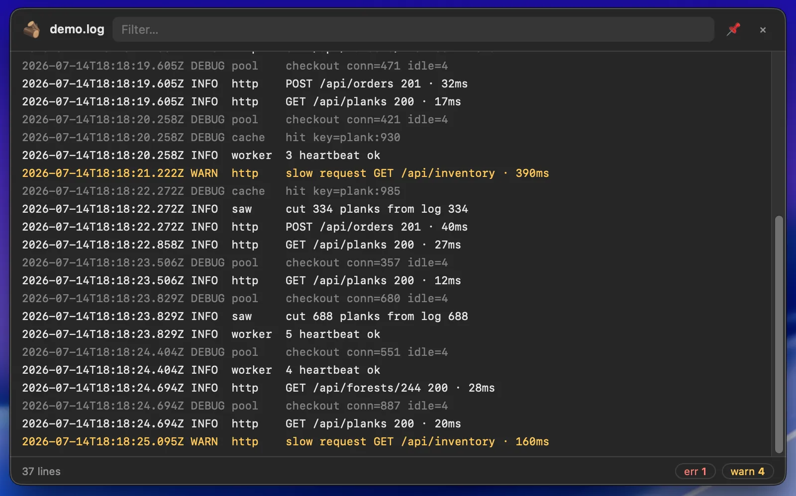
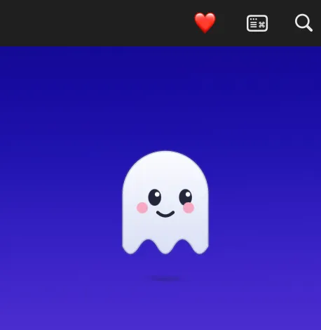
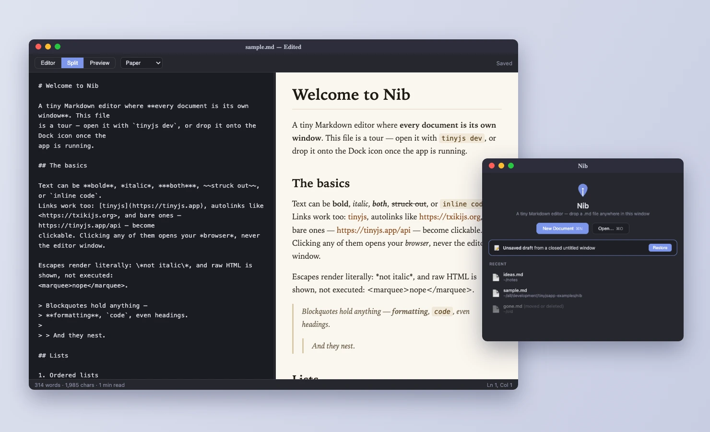
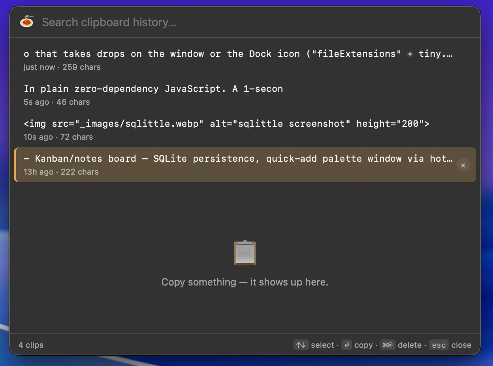
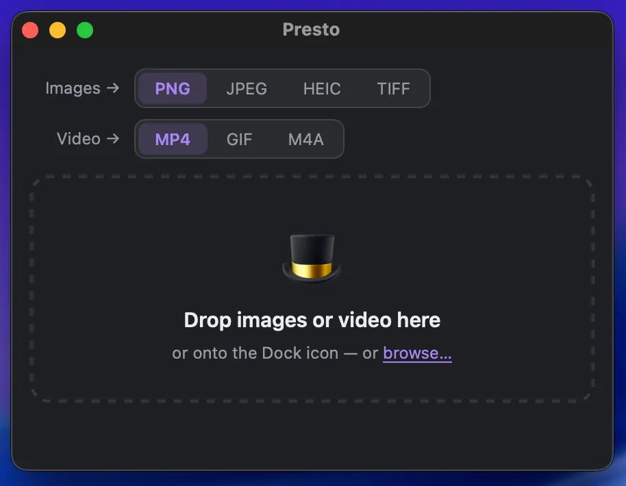
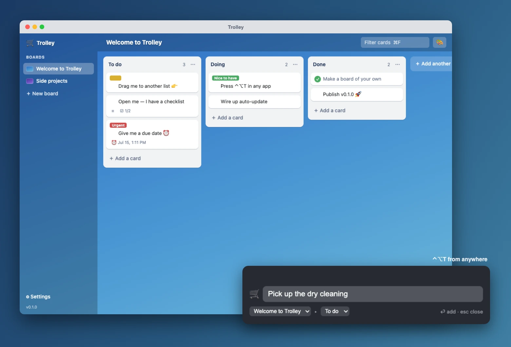
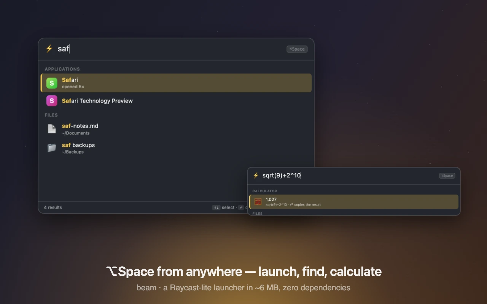

# tinyjs examples

Example apps for **[tinyjs](https://tinyjs.app)** — tiny (~6 MB) macOS desktop
apps built from a txiki.js backend and a native WebKit window.

## Getting started

1. Head to **[tinyjs.app](https://tinyjs.app)** and install the `tinyjs` CLI.
2. Clone this repo.
3. Pick an example, `cd` into it, and run it:

   ```sh
   cd kitchen-sink
   tinyjs dev      # run with hot reload
   tinyjs build    # produce dist/<Name>.app + a single binary
   ```

Each example is a self-contained project with its own `tinyjs.json`,
`src/main.js` (backend), and `src/frontend/` (the page).

## Examples

### **[kitchen-sink](kitchen-sink/)**


"Tiny Deck", a command deck that shows off the tinyjs API surface: running shell commands from the page, native notifications, tray mode, global hotkeys, window/menu control, file dialogs, frameless chrome, and a second native window (the Inspector) sharing one backend.

### **[tinyslaq](tinyslaq/)**


"TinySlaq", a Slack-style chat clone. Multiple colored workspaces and accounts, channels and DMs, messages persisted in SQLite, a "post as" switcher, canned DM auto-replies pushed live over the bridge, plus desktop notifications for the channel you're not looking at. (A UI demo — not affiliated with Slack.)

### **[matcha](matcha/)**


A menu-bar app that toggles macOS `caffeinate` on and off to keep your Mac awake. Left-click toggles, right-click opens a stateful menu (live status + "Activate for" duration submenu that auto-stops).

Launches as a menu-bar agent (`"activation": "accessory"` — no Dock icon, no window flash) with an SF Symbol cup icon, and opens two fixed-size windows on demand (0.8.0 multi-window): a little About popover and a tabbed Settings window (General / Duration / Battery / Advanced / Updates / About) persisted with `tiny.store`. The canonical tinyjs *tray app* recipe.

### **[tomato](tomato/)**

#### A silly, tomato-shaped Pomodoro timer.


The window is **transparent and frameless** so it floats on the desktop as a round googly-eyed tomato — no square edges. The countdown ticks live in the **menu-bar title** (`tray.set` every second), pausing swaps Pause↔Resume **in place** (`menu.update`, no full repaint), and a phase-end **notification pops the tomato back up when clicked** (`onNotificationClick`). 

Launches as a menu-bar agent (`"activation": "accessory"`). The canonical *transparent window* + live-tray recipe.

### **[worldclock](worldclock/)**

#### A menu-bar world clock.


The tray title **cycles through cities** every few seconds (`tray.set` each tick — "Tokyo 4:45p" → "London 8:45p" → …), and a left-click drops a small **vibrancy panel** (`"chrome": { "vibrancy": "popover" }`) just under the menu bar that lists every city's live time, day offset, and a day/night dot. It **dismisses itself on focus loss** like a real popover (the page's `window` blur). Neat wrinkle: txiki.js has no `Intl`, so the WebKit page computes each zone's DST-correct UTC offset and hands the backend a table — frontend knows the zones, backend owns the tick. Launches as a menu-bar agent (`"activation": "accessory"`).

### **[lumber](lumber/)**

#### A log-tailing HUD in plain zero-dependency



JavaScript. Open or drop a log file and it live-follows the tail in an **always-on-top translucent panel** (`"vibrancy": "hud"` + `setAlwaysOnTop`) that floats over your editor: filter box, error/warn colorizing and counters, stick-to-bottom follow. Under the hood it's `tjs.watch` kernel file events + offset reads (only the new bytes are ever read) + a streaming `TextDecoder`, with truncation and logrotate handled like `tail -f`. No log handy? A built-in demo service logs forever.

### **[boo](boo/)**

#### A shy little desktop ghost, in plain zero-dependency



JavaScript. The transparent frameless window **is** the pet: it wanders the screen by **moving its own window** (`setPosition` every brain tick), flees your cursor — whose global position it reads via **FFI** (`tjs:ffi` → CoreGraphics `CGEventGetLocation`, no permissions needed) — and *poofs* to safety when cornered. Hold out a cookie (menu bar / ⌃⌥C) and your cursor becomes the treat: boo creeps over in nervous bursts, eats it, then follows you around like a puppy and lets you pet it. Each cookie grows a persisted `trust` stat that makes it braver. The tray title is its live mood: 👻 🍪 ❤️ 💤.

### **[kraa](kraa/)**

#### Two ravens loose on your desktop, in plain


Zero-dependency JavaScript. **Three windows, one brain**: the main window is one raven, `app.openWindow` makes the second (same page) and the seed pile, and a single 25 fps backend tick steers them all — per-window `setPosition`, broadcast pushes tagged `who` so each page wears only its own state. The birds strut, peck, preen, caw at each other (and answer back), and take flight when your FFI-tracked cursor gets too close or the ground gets boring. Scatter seed (**⌃⌥S**) and the flock flies in; every finished pile grows a persisted `trust` stat, and trusted ravens start following your cursor around — while still doing their own thing.

### **[nib](nib/)**

#### A tiny Markdown editor — one window per document



In plain zero-dependency JavaScript, renderer included. A Welcome window (recents + dropzone) plus `app.openWindow` per file — menu events broadcast to every page and the focused one acts. Editor/preview split with synced scrolling, clickable task boxes that edit the source, and four preview themes that follow the document into **⌘P** (the print panel's *Save as PDF* is the PDF exporter) and **Export as HTML** (a standalone themed file). Closing is lossless: the red ✗ can't be vetoed (`onWindowClosed` fires after it's gone), so a dirty window leaves a `tiny.store` draft that's restored on reopen — while **⌘W** gets a proper Save / Don't Save / Cancel sheet. Double-click any `.md` in Finder (`"fileExtensions"` + `onOpenFiles`) and it opens here.

### **[pasta](pasta/)**

#### Clipboard history in the menu bar



In plain zero-dependency JavaScript. A 1-second `pbpaste` poller upserts into SQLite (`tjs:sqlite` — same text bumps to the top), **⌘⇧V** anywhere (`hotkey.register` + `onHotkey`) summons a frameless vibrancy palette: type to search, ↑↓ + ⏎ to re-copy via `pbcopy`, click-out dismisses. The Pause Capturing flag persists with `tiny.store`. Tray + hotkey + frameless + sqlite + store in one genuinely useful app.

### **[presto](presto/)**

#### Drop a file, ✨ it's converted.



A dropzone for images and video that takes drops on the window **or the Dock icon** (`"fileExtensions"` + `tiny.app.onOpenFiles`): images through macOS's built-in `sips`, video through `ffmpeg` with a **live progress bar** parsed off its stderr, outputs landing next to the source, and a notification whose **click reveals the file in Finder* (`onNotificationClick` → `open -R`). Real-path drag & drop — the page gets filesystem paths, not blobs.

### **[procsy](procsy/)**

#### A process & open-port inspector in **React 19 +


Radix UI + TypeScript** (`--template react-ts`: create-vite + HMR in the native window, esbuild-bundled TS backend). Live `ps` and `lsof -i` tables with filtering and click-to-sort, CPU badges, and per-row kill actions (SIGTERM/SIGKILL) that go through **native confirm dialogs**. The Radix theme follows the system light/dark mode live.
  
### **[sqlittle](sqlittle/)**

#### A little SQLite browser in **Vue 3


PrimeVue + TypeScript** (`--template vue-ts`). Double-click a `.db` file in Finder and it opens here (`"fileExtensions"` + `tiny.app.onOpenFiles`), or drop one on the window. Table list with row counts, lazy-paginated PrimeVue DataTable browsing, and a ⌘↩ query box — all on txiki's built-in `tjs:sqlite`, so the backend is ~100 lines with zero dependencies. Ships a `sample.db` to poke at.

### **[trolley](trolley/)**

#### A tiny Trello, all local — and the shipping recipe



**Vue 3 + radix-vue + Pragmatic drag and drop**, cards and lists persisted with `tjs:sqlite` in a folder you pick on first run. Drag cards between lists, give them labels / due dates / checklists, dress boards in gradients or your own image. Due cards tally in the **menu bar** (`🛒 3`) and fire **notifications whose click opens the card**; **⌃⌥T anywhere** pops a frameless quick-add palette (a second window from one Vite app). Also the documented **auto-update example**: `tinyjs publish` → zip + manifest, `update.check` / `update.install` wired to File ▸ Check for Updates — with a README walkthrough you can run entirely locally.

### **[beam](beam/)**

#### A Raycast-lite launcher, in plain zero-dependency



JavaScript. **⌥Space anywhere** (`hotkey.register` + `onHotkey`) summons a frameless vibrancy palette that hides on Esc or focus loss: fuzzy-launch any app (the index is a plain `tjs.readDir` scan; **real app icons** come from a `plutil` → `sips` → png-cache → `data:` URI spawn pipeline), find files through Spotlight (`mdfind`, ⏎ opens / ⌘⏎ reveals), or type math — a real tokenizer + recursive-descent parser, never `eval()`, ⏎ copies the result. Launch counts persist in `tiny.store` so your apps float to the top. The page fuzzy-scores locally (best alignment by DP, so `vsc` bolds the word starts in **V**isual **S**tudio **C**ode) — typing costs zero bridge traffic.