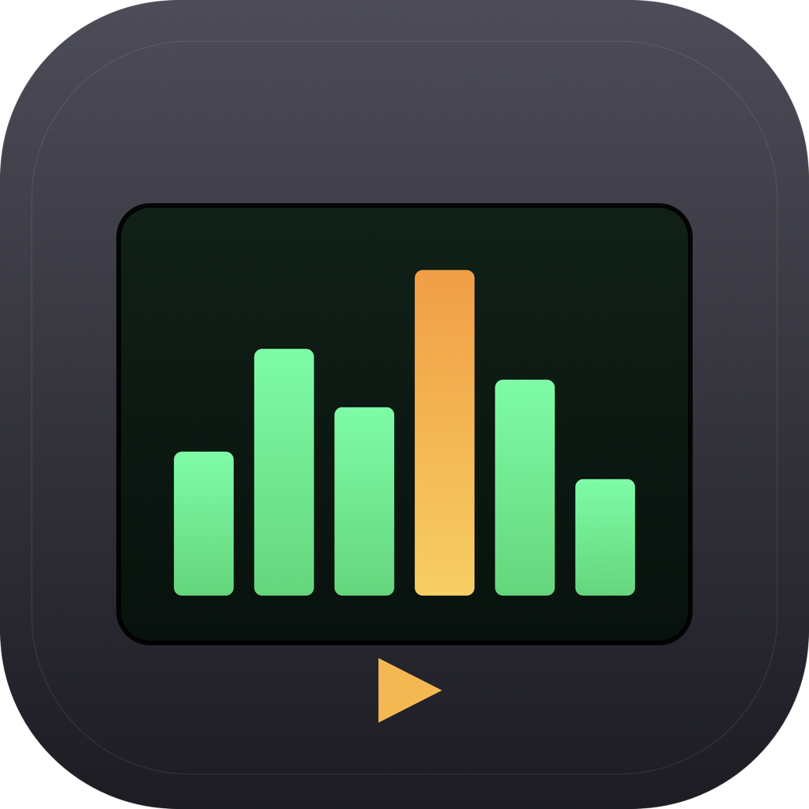
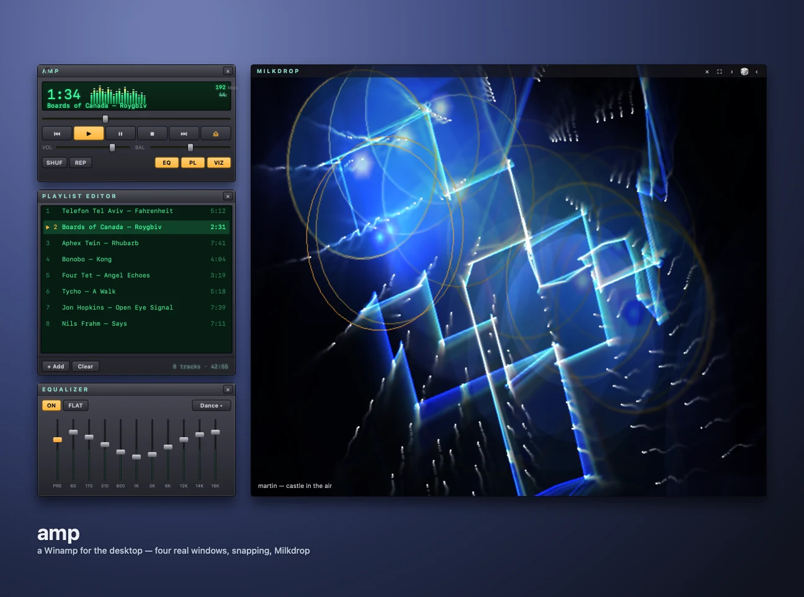

# amp 🎵





**⬇ Download:** [amp-0.7.0.dmg](https://github.com/tarwin/tinyjsapp-examples/raw/main/_builds/amp-0.7.0.dmg) **(5.2 MB)** — prebuilt, signed & notarized; open and drag to Applications.

A Winamp for the desktop — plain JavaScript, zero dependencies, and each pane
is a **real native window**.

The web [Webamp](https://webamp.org) recreates Winamp beautifully, but its
"separate windows" are draggable `<div>`s inside one browser page. tinyjs 0.20
added **multiple windows** — any html file in your frontend can be its own OS
window — so amp does the honest version: the **player**, **playlist**,
**equalizer**, and **visualizer** are four independent windows you drag
around, snap together, and (the visualizer) send fullscreen. And when four
windows is three too many: **BIG** (or **B**) swaps the whole thing for one
fullscreen 80s hi-fi stack — wood cheeks, VU needles, LED spectrum bridge,
rotary volume knob — floating over a full-bleed run of either visualizer. Or
neither: the ⇄ cycles to a third "engine", **speakers**, which centers the
stack between two giant floor speakers whose woofers, mids, and tweeters pump
along to the music (wildly out of proportion, as is right) — and the bar's
**‹ ›** buttons (or ←/→) swap in a **collection of six classic cabinets**,
from studio nearfields to electrostatic panels. Pick a headphone-correction
profile and **the matching cans appear parked on a speaker**, curly cord and
all, while the cones go still — velour DT-types, grille-backed open-backs,
aluminum AirPods-Max-ish slabs, wireframe Porta-Pro-ish on-ears, even little
buds and in-ears just lying on the cabinet. And there's a **world radio**: spin
the LED globe — it wears real coastlines and country borders (Natural Earth,
squeezed to 28 KB) and **scroll- or pinch-zooms** from whole-Earth down to
5×, the graticule densifying as you close in — click a city, and tune real
live streams from stations near it. It lives in the rack as a tuner unit
*and* as its own little **RAD** panel among the regular windows. On the air,
the big screen sprouts a little **antenna** with a blinking red tip, the
clock slot shows a pulsing 📡 (a live stream has no elapsed time — the
menu-bar pill reads **LIVE**), and the scrub bar goes politely inert. And if your Mac is
in light mode, the whole rig is **brushed silver** — 1979's finest aluminum;
the displays stay dark, they're screens. **STANDBY** (or Esc) puts it back on
the desk.

The visualizer has **six real engines** you cycle with the ⇄ button
(choice persisted): **Milkdrop** via
[butterchurn](https://github.com/jberg/butterchurn) (WebGL), **Geiss HDR**
— [Ryan Geiss's modern WebGPU rewrite](https://www.geisswerks.com/geiss_hdr/)
of the 1998 Geiss screensaver — vendored under Apache-2.0 with an
external-audio adapter (see [src/geiss-hdr/](src/geiss-hdr/README.md)) — and
**Magnetosphere**, amp's own homage to
[Robert Hodgin's particle pieces](https://roberthodgin.com/project/magnetosphere):
a small solar system of **dark planets**, each wearing a dandelion of ~8,000
glowing particles that stretch into **hair-fine filaments** along their
motion (energy-conserving, so a filament carries the light of the dot it
was), ringed halo **cores** pulsing with the bass — some planets glow from
within, some stay pitch black — all wrapped in drifting **smoke** that pools
around the living planets. The piece changes **mode** every half-minute:
lone giant, binary, cluster, nebula, void (🎲 jumps modes by hand). And
**three more homegrown engines** after it: **Lagoon** — liquid smoke from a real
CPU fluid sim (semi-Lagrangian advection on a 256×144 grid, uploaded as a
texture) stirred by a school of glowing koi that inject velocity as they
swim, chasing drifting plankton motes — beats blanch their bodies white,
bass glows their rims; **Murmuration** — 4,200 starlings over a burning dusk sun, steered
by a real flow-field flock model (alignment + separation + a wandering
roost), bass breathing the flock tight, a hard beat sending a falcon
through so the sheet blooms apart; and **Ballroom** — the Sony-Bravia
fantasy, hundreds of iridescent and amber bouncy balls raining down a dark
hall of stairs, real instanced-box 3D with a depth buffer, sphere-impostor
balls, CPU bounce physics, beats pouring in fresh bursts — shot by a
**still camera that jump-cuts** between front-on stair framings (the motion
belongs to the balls), while the balls' glow pools on the steps as fake GI. All four render
in **WebGPU** (trails in ping-pong `rgba16float` where they need them), and
on an HDR display the canvas runs extended tone mapping so cores, suns and
amber glass genuinely burn past white — probed Geiss-style (render + read
back, never trust `configure()`), with timeouts so an occluded window can't
hang the probe. Magnetosphere keeps a WebGL1 fallback; zero dependencies
throughout.

And **podcasts** 🎙 — the **POD** button opens a phosphor-screen podcast
deck: a **shelf** of your shows (list or artwork grid), a **FAVES** tab
pre-stocked with sixty hand-picked feeds, and ＋ to add any RSS URL. Episodes
play **on the deck like tracks** — EQ, spectrum, media keys, real seeking —
and ▶ is **offline-first**: not-yet-downloaded episodes download with a live
count on the button and play the moment they land (double-click streams
immediately via `tiny.proxyURL`, which honors range requests). Clicking an
episode unfolds its **show notes**; the sort button cycles newest / oldest /
unheard; **listened-tracking** remembers your position (resume where you
left off, ✓ when finished) and **⤓ downloads** live in Application Support
with a one-click cache clear. Feeds are fetched by the backend (no CORS
there) and parsed in the page (WKWebView has DOMParser, txiki doesn't). The
big screen's tuner has a **POD** switch too — the globe flips into an
artwork wall of your shelf — and while an episode plays, its cover leans
against the gear as an **LP sleeve**, vinyl peeking out the side.

Drop audio on any window (or hit **⏏ / + Add**), and press play. In the
playlist, **double-click plays a track now**; a **single click queues it to
play next** (a `»` marker — click again to unqueue); **drag a row to
reorder** (the playing track and the queued `»` follow their songs, not their
row numbers). Space and **⌘←/⌘→** are
play/pause and prev/next from *any* amp window. Windows drag
by their titlebars and **snap** magnetically to screen edges and to each other;
dock the satellites to the main window and they travel with it. **Double-click**
a titlebar to collapse it to a **windowshade** strip; **right-click** (or
**⌘A** in any window) for an Always-on-Top toggle; and a **menu-bar**
play/pause button is there by default. The
equalizer is a real 10-band filter bank with
**[AutoEq](https://github.com/jaakkopasanen/AutoEq) headphone correction**
(pick your headphones, they get neutralized —
[autoeq.app](https://autoeq.app) has the full database), the media keys and Control Center
work, and the visualizer is the actual Milkdrop engine — or the actual Geiss
engine — running fullscreen.

The right-click menu also holds three app-wide preferences (all persisted):
**Theme** — follows the system appearance by default, with Light/Dark
overrides (the brushed-metal chassis swaps; the phosphor LCDs stay dark,
they're *screens*); **Display** — which phosphor the readouts glow in:
**green** (default), **amber**, **ice blue**, or **plasma red** — one CSS
palette re-tints every display, list, spectrum, and the radio globe across
the small windows (the big screen keeps its amber-and-green rack identity);
and **Appear In** — Dock & menu bar (default), menu bar
only (the Dock icon drops away via a live activation-policy flip), or Dock
only (the tray item is removed; it's in the tray's menu too). The player's
little spectrum is **seven displays in one** — click it to cycle analyzer
bars, LED dots, a spectrum line, mirror bars, an oscilloscope, L/R level
rails, and a scrolling spectrogram (choice persisted, all four phosphors
apply). Windowshaded bars carry their readouts in a little **inset display
chip**, so the phosphor text stays legible on silver in light mode — the
shade resizes horizontally (never vertically), and unshading at the bottom
of the screen pushes the window up to fit.

**Track Info** (a fifth window) reads whatever's playing and paints a little
sleeve-notes card — embedded cover art, artist/album/date, format, length,
size, and a click-through link when the file carries one. All of it comes
from a from-scratch tag parser (`src/meta.js`) that reads the file head in
the txiki backend and understands ID3v2 (APIC art), FLAC, MP4/M4A `covr`,
and **Ogg/Opus** `METADATA_BLOCK_PICTURE` — the same art feeds the sleeve and
a new **album-art** visualizer mode. And amp now **plays Opus**, so it ships
with a **sample track** (right-click → *Load Sample*, or it's the first thing
in an empty playlist) that plays out of the box before you've added a folder.

```sh
tinyjs dev      # run with hot reload
tinyjs build    # package dist/amp.app
```

## Four windows, one backend

Windows each run the full `tiny.*` bridge but **can't talk to each other**, so
`src/main.js` is the hub:

- the **player** (`index.html`) is the audio host and brain; when its state
  changes it calls `api publish(state)`, which the backend broadcasts as a
  `state` event to everyone else;
- the **playlist / eq / viz / rack** send user intent as `api action(a)`,
  which the backend pushes to the player as an `action` event;
- a freshly opened window asks `api hello()` for the current state.

The player's **EQ / PL / VIZ / BIG** buttons call `toggleWindow`, which
`app.openWindow`s a satellite the first time and hides/shows it after (so its
position survives) — `app.window(id).hide()/show({ activate: false })`.

## The techniques

1. **Multiple windows (0.20)** — `app.openWindow(id, { page, size })` and
   `tiny.win.open`; `app.window(id)` drives each one (`setPosition`,
   `getState`, `push`, `hide`, `fullscreen`), and `app.push` broadcasts to all.
   `meta.window` on an api handler says who called.
2. **One-click across windows** — every window sets `chrome:
   { acceptsFirstMouse: true }` (0.22.5), so the click that *focuses* a window
   also lands on whatever it hit. Without it, WKWebView eats the activating
   click and every cross-window action costs two clicks (click a playlist row,
   then click ▶ in the player — nothing happens until you click again).
   Winamp-style control panels are exactly what macOS click-through is for.
3. **Magnetic dragging** (`drag.js`, shared by every window) — frameless
   windows have no titlebar, so we drag them from a pointer's **global**
   `screenX/screenY` (true displacement even as the window moves under the
   cursor) and snap the result to screen edges and sibling rects (which only
   the backend can see — `api rects`). Dragging the **main** window carries its
   whole docked cluster in one batched `moveGroup` call so they travel in
   lockstep, and a docked edge lights up so you can see what's attached.
4. **Web Audio in the page** — the player builds
   `MediaElementSource → preamp → 10× BiquadFilter (peaking) → headphone
   correction (own preamp + 10× parametric BiquadFilter) → StereoPanner →
   AnalyserNode → destination`. The equalizer window's sliders set the graphic
   filter gains; the analyser drives the little canvas spectrum. The 🎧 menu
   below the sliders loads an **[AutoEq](https://github.com/jaakkopasanen/AutoEq)
   correction profile** for your actual headphones — 59 popular models baked
   into [autoeq.js](src/frontend/autoeq.js) — retuning the second chain's
   filters (`LSC`/`PK`/`HSC` → lowshelf/peaking/highshelf) and preamp.
   Correction is deliberately independent of the **ON** switch: ON gates the
   tone curve you drew by hand; the profile neutralizes the headphone
   underneath it, and the two stack. (One knowing simplification: WebAudio
   shelf filters have a fixed slope and ignore Q — AutoEq's shelves are Q 0.7,
   close enough to WebKit's default that the difference is inaudible.) Model
   not in the menu? See *Correcting your headphones with AutoEq* below.
5. **Now Playing + media keys** — `tiny.app.nowPlaying.set({ title, artist,
   duration, elapsed, playing })` puts amp in Control Center and the lock
   screen, and `tiny.app.onMediaKey` routes the F7/F8/F9 keys (and AirPods) to
   play / pause / next / previous / seek.
6. **Milkdrop and Geiss, for real** — the visualizer window embeds
   [butterchurn](https://github.com/jberg/butterchurn) (the Milkdrop engine the
   Webamp family uses, MIT) on a WebGL canvas, **and**
   [Geiss HDR](https://www.geisswerks.com/geiss_hdr/) (© Ryan Geiss,
   Apache-2.0) on a **WebGPU** canvas — yes, WebGPU works in a tinyjs
   WKWebView, **HDR included**: before starting Geiss, viz.js probes the real
   failure mode (older WebKit *accepted* an `rgba16float` canvas but presented
   black — configure, render a clear, read pixels back), and on an HDR display
   with a passing probe Geiss runs its full HDR path with extended tone
   mapping (Ctrl+H toggles HDR/SDR to compare); anything less falls back to
   SDR. The ⇄ button swaps
   engines; the parked one keeps its rAF loop alive but does zero work. A
   covering window throttles the player's timers and no window can reach
   another's audio graph, so each visual window analyses a **hybrid** of
   its own: a silent twin `<audio>` (element volume 0 — not `muted`, which
   blinds the analysers) mirrors whatever the page *can* reach itself —
   file tracks off disk, radio through `tiny.proxyURL` — and
   **`tiny.audioTap`** (tinyjs 0.25, `"audioTap": "app"` in the manifest,
   macOS 14.4+) steps in *only* for streams the page can't touch: the
   raw-fallback stations. The tap delivers the app's rendered output as
   PCM chunks, rebuilt into `AudioBuffer`s and scheduled gap-free into the
   same analyser-only graph. The split exists for a reason beyond tidiness:
   starting a tap triggers macOS's one-time **"record your system audio"**
   consent — even for app scope, because WebKit renders audio in a helper
   process that TCC counts as capture — so amp arms it only when an
   untappable station actually plays, and someone who never tunes such a
   station is never asked. (The grant sticks for a properly signed build;
   ad-hoc dev builds re-prompt every rebuild. And under `tinyjs dev` the
   tap only delivers if your *terminal* holds the grant — the terminal,
   not the app, owns dev audio — so tap features are best tested against
   the built .app.) While Geiss is up,
   press **H** for its whole keyboard (randomize, locks, brightness, motion
   speed…); ←/→/🎲 randomize the visuals. On a track change each engine shows
   the title its own way — Milkdrop swirls it through the preset
   (`launchSongTitleAnim`), Geiss paints it into the image (its embed-title
   path; its T key repaints on demand) — and the bar's **T** toggle turns
   titles off entirely (persisted). The ☺ button credits both projects
   with links (opened in your browser, not the app).
7. **Reading audio off disk** — a WebKit page can't load `file://` media
   outside its own directory by default, so `tinyjs.json` sets
   **`"readAccess": true`** (widen the read root to the home dir) and each
   `<audio>` loads the track straight off disk — no bytes ever cross the bridge.
   The backend only stats the file for the bitrate readout.
8. **Session persistence** — `tiny.store` remembers the whole layout: playlist,
   volume/balance, EQ curve, which panels are open, every window's position,
   each window's shade state, the always-on-top flag, the theme override, the
   Dock/menu-bar choice, which visualizer engine you left up, which speakers
   flank the big screen, and where on the globe your radio dial points — so
   relaunching puts it all back exactly where you left it.
9. **Menu bar, windowshade, docking, always-on-top** — the menu-bar item is a
   **split pill**, Harvest-style ([till](../till/README.md)'s recipe): the
   tray is one NSStatusItem, so the widget — a ▶/⏸ chip (amber while
   playing) plus a dark chip showing the elapsed time, or the **AMP**
   wordmark when idle — is rasterized to a fixed-width PNG by the backend
   itself (RGBA buffer, 3×5 bitmap font, hand-encoded PNG @2x with a 144 dpi
   `pHYs`), and the two click zones are resolved by geometry: on left-click,
   compare `app.mousePosition()` against `app.tray.position()` — glyph side
   toggles playback, time side opens the player. Right-click keeps the
   transport menu (`onTray`). And while music plays the **Dock icon dances**:
   the player page draws 6 frames of the icon (chassis + green LCD + phase-
   shifted spectrum bars) on a canvas, ships them to the backend once as
   base64 PNGs, and `app.dockIcon()` flips through them every 320 ms —
   `''` restores the bundle icon on pause (toggleable: "Animated Dock Icon"
   in the tray and right-click menus, persisted). Double-click a titlebar to collapse it
   to a **shade** strip that still works: the main bar keeps transport + time,
   the playlist shows the current track, the equalizer shows draggable
   volume/balance (it keeps its top-left corner on collapse). Right-click is a
   single **Always on Top** toggle (`tiny.menu.setContext`, which also replaces
   WebKit's default menu → no *Inspect Element*) that the backend applies to
   **every** window at once — global, not per-window. **⌘A** in any window is
   the same toggle (drag.js rides along in all four, so the shortcut does too).

10. **BIG SCREEN — the rack** (`rack.html` / `rack.js` / `rack.css`) — the
    whole hi-fi as one more satellite window that fullscreens itself on open
    (viz-style chrome; a `squareCorners` window can't enter native
    fullscreen). It's a floor-standing stack drawn in CSS — wood cheeks, rack
    screws, a receiver with cream-dial **VU meters** (needle ballistics:
    fast attack, lazy decay, latching peak LED), drag-to-turn rotary
    **volume/balance knobs**, an EQ unit with a 10-column **LED spectrum
    bridge** over long-throw faders (plus the same AutoEq 🎧 menu), and a
    green-LCD **program deck**, plus a little clock in the bottom strip (on
    the rack, not floating — everything's diegetic) — all over a full-bleed
    run of either viz engine. A third "engine" on the ⇄, **speakers**, drops
    the shaders entirely: the stack centers and two giant CSS speaker
    cabinets flank it — wired to the rack with drooping red/black SVG pairs
    laid from the live element rects — their cones scaled per-frame from
    three spectrum bands via CSS custom properties (woofer ↤ bass, mid,
    tweeter ↤ treble — deliberately over-responding, though the cabinets
    themselves hold still). In this engine the bar's **‹ › step the speakers
    themselves** (the same buttons that step Milkdrop presets — ←/→ too, and
    the model name flashes like a preset name): six models, every one pure
    CSS and a loving cartoon of a
    legend (see credits): the original three-way towers, MSP5-ish powered
    nearfields up on stands (their power LEDs breathe with playback), L100-ish
    monitors in walnut with the burnt-orange **quadrex foam grille** (a
    four-quadrant `repeating-conic-gradient` tile reads as a field of foam
    pyramids; the whole grille breathes on the bass), LS50-ish minis whose
    rose-gold concentric driver does everything, ESL-57-ish **electrostatic
    panels** on splayed legs (no cones — the bronze mesh just glows with the
    program), and 801-ish sphere-head studio monsters with a woven yellow
    midrange. Each model carries two invisible markers — where the speaker
    wire lands and where things may rest on it — so the SVG cabling relays
    itself to whatever is standing there. And if a **headphone-correction
    profile** is active, the receiver's ¼″ phones jack shows a plug, the
    **matching cans park on the left speaker's rest marker** — the chosen
    AutoEq model maps to a visual family: DT 770-style closed-backs (black
    stitched headband, gray velour pads) by default, **open-backs** whose
    shells become speckled grilles, **AirPods-Max-ish** anodized slabs with
    a canopy band, **Porta-Pro-ish** twin-wire on-ears, and in-ears/earbuds
    that skip the headband entirely and just lie on the cabinet — a properly
    **curly cord** (cubic Béziers with swapped control points — each one
    crosses itself into a coil) runs down the faceplates and along the floor
    into the jack, and the excursion targets decay to zero: the cans got the
    signal, the room went quiet. The rack is also the one window with its own
    **light mode**: brushed-silver faceplates, knobs, and cabinets via a
    `data-theme` palette swap (it mirrors drag.js's system-theme logic since
    it doesn't load drag.js) — every display stays dark either way. Same
    satellite contract as every panel (broadcast `state` in, `action`s out),
    and everything that must stay smooth — both engines, the VU needles, the
    LED bridge, the pumping speaker cones — runs on the same hybrid
    twin-plus-`audioTap` analysis as the visualizer window (one graph per
    window; the tap only for stations the twin can't mirror).
    The backend keeps the rack out of every snapping / raise / reflow loop:
    `show()` on a window living in its own fullscreen Space would yank the
    user out of whatever Space they're in. It's also exempt from
    **Always-on-Top** — a floating-level window can't enter native fullscreen
    at all (it silently stays windowed) — and while the rack is up the OTHER
    windows' floating is suspended too, since floating windows hover over
    fullscreen Spaces and an on-top playlist would photobomb the big screen
    (the preference itself is untouched; levels come back on exit).
    **STANDBY** (or Esc) un-fullscreens,
    waits out the animation, then hides it.

11. **WORLD RADIO — real streams off a spinning globe** — one tuner brain
    ([tuner.js](src/frontend/tuner.js)), two faces: a unit in the rack and a
    standalone **Radio panel** (the player's **RAD** button) that snaps,
    docks, and windowshades like the playlist and EQ. It draws an
    orthographic **LED globe** on a canvas: graticule plus a
    constellation of ~100 major cities (no basemap needed on a phosphor
    display), idly rotating until you drag it. Click a city and the backend
    asks **[radio-browser.info](https://www.radio-browser.info)** — the
    community-run open radio directory — for stations near it
    (`geo_lat`/`geo_long` + a radius that widens from 150 km until there's a
    dial's worth, walked across volunteer mirrors, sorted by true distance,
    then filtered to **https + WebKit-decodable codecs**: MP3/AAC/HLS —
    tuning a station also pings the directory's click counter, which feeds
    its popularity rankings). The first launch guesses your city from the
    system timezone; the choice persists. Click a station and the **player**
    streams it on a dedicated `<audio>` — and thanks to **`tiny.proxyURL`**
    (tinyjs 0.24), that element loads the stream *through the native layer*
    with permissive CORS, so its `MediaElementSource` is untainted and radio
    runs **through the full EQ graph**: graphic EQ, headphone correction,
    balance, spectrum, all of it, exactly like a file (a raw cross-origin
    stream would be spec-mandated silence inside the graph, and internet
    radio rarely sends CORS — the proxy is what makes this possible, while
    CoreMedia keeps doing the buffering and reconnects). Streams the proxy
    can't carry (some stations answer with a redirect; HLS is a playlist,
    not a byte stream) **quietly fall back to plain playback** on a second,
    never-captured element — no EQ for those, but they always play; the
    error/stall handler swaps elements automatically, because raw playback
    on the captured element would just be CORS silence. The state carries a
    `raw` flag so every meter window knows which path won: proxied stations
    are mirrored by the twins (no permissions involved), and fallback/HLS
    stations — the only audio the pages can't reach — light up via
    **`tiny.audioTap`**, which arms at exactly that moment and nowhere
    else, since starting a tap is what triggers macOS's system-audio
    consent. (This feature's engineering saga ran four acts: a backend
    relay chunking a second stream over the bridge; `proxyURL` twins with
    element-volume-zero guards — natively-played HLS bypasses
    `MediaElementSource` and once played out loud over main's copy, and
    `muted` would have blinded the analysers; a brief everything-on-the-tap
    era; and this hybrid, which keeps the permission prompt away from
    everyone who doesn't need it.) The receiver shows **LIVE**
    instead of a duration, seeking is disabled, ⏭/⏮ (including the
    hardware media keys) step **stations** instead of tracks, playing any
    deck track hands the system back, and **OFF** (or the tray/media
    controls) kills the stream. Clicking the station that's already on the
    air is a deliberate no-op — a double-click must never tear the stream
    down just to reconnect it (only a dead, errored stream retunes). City
    search never blocks the UI — a sequence counter drops stale scans if
    you click another city mid-fetch.

The classic look is **CSS, not ripped skin bitmaps** — a homage, so there's no
trademark or copyright baggage — and every track name reaches the DOM through
`textContent` (the page holds an RPC channel with full system access, so a
filename must never become markup).

## Correcting your headphones with AutoEq

Every headphone colors the sound — a bass hump here, a treble spike there.
[AutoEq](https://github.com/jaakkopasanen/AutoEq) publishes measured
corrections that EQ a specific model toward the
[Harman target](https://en.wikipedia.org/wiki/Harman_target_curve) (the tuning
most listeners rate as neutral). amp uses those corrections directly:

- **If your model is in the 🎧 menu** (equalizer window, below the sliders):
  just pick it. The correction runs in its own filter chain *underneath* the
  ten sliders, so the curve you draw by hand is taste on top of a neutralized
  headphone — and it stays active even with the EQ switched **OFF** (ON gates
  your curve, not the correction).
- **If it isn't**, the full database — thousands of models, updated as new
  measurements land — is at **[autoeq.app](https://autoeq.app)**: search your
  headphone, and prefer an **oratory1990** measurement when offered (that's
  the single source all of amp's bundled profiles use, so results are
  comparable). Then either:
  - pick the **Parametric Eq** output — its numbers are exactly amp's format,
    so add one line to [autoeq.js](src/frontend/autoeq.js)
    (`{ c, n, p: <preamp dB>, f: [[PK|LSC|HSC, Fc, gain dB, Q], …] }` — the
    file header documents it) and run `tinyjs dev`; or
  - skip the code entirely and **dial it in by hand**: use
    [autoeq.app](https://autoeq.app)'s
    fixed-band / graphic EQ output as a guide for amp's ten sliders
    (60 Hz – 16 kHz) and put its suggested preamp on the **PRE** slider.
    Coarser than the parametric chain, but no rebuild.

The preamp values are negative on purpose — corrections boost dips, and
without headroom a boost clips; the profile's preamp makes room first.
[autoeq.app](https://autoeq.app) also has a bass-boost slider and alternative
targets if flat-Harman isn't your taste — anything it produces in parametric
form drops into amp.

## Credits & licenses

amp's visualizers are real third-party engines, gratefully vendored, and the
equalizer's headphone profiles come from a real measurement project:

- **[AutoEq](https://github.com/jaakkopasanen/AutoEq)** by Jaakko Pasanen
  (MIT) — frequency-response corrections that EQ headphones toward the Harman
  target. amp bakes 59 popular models' parametric results into
  [autoeq.js](src/frontend/autoeq.js), converted verbatim from the repo's
  `ParametricEQ.txt` files (fetched 2026-07-16). All 59 come from a single
  measurement source — **[oratory1990](https://www.reddit.com/r/oratory1990/)**'s
  GRAS rig measurements, whose data remains the property of its author — so
  profiles are mutually comparable. The full database (thousands of models,
  more sources) lives at [autoeq.app](https://autoeq.app); results there are
  usable in amp's terms too, they just aren't bundled. Not affiliated with or
  endorsed by AutoEq, oratory1990, or any headphone manufacturer — model names
  identify which headphone a profile corrects, nothing more.

- **[butterchurn](https://github.com/jberg/butterchurn)** +
  [butterchurn-presets](https://github.com/jberg/butterchurn-presets) (MIT) —
  jberg's WebGL port of MilkDrop 2. Bundled as `butterchurn.min.js` + a
  curated `presets.min.js`, inlined into the visualizer window at build time.
- **[Geiss HDR](https://www.geisswerks.com/geiss_hdr/)** © 2026 Ryan Geiss
  (Apache-2.0) — the modern rewrite of the 1998
  [Geiss screensaver & Winamp plug-in](https://www.geisswerks.com/geiss/).
  Vendored in [src/geiss-hdr/](src/geiss-hdr/README.md) with its LICENSE,
  NOTICE, and OUTPUTS files and every amp modification marked; rebuilt into
  `geiss-hdr.bundle.js` by `src/geiss-hdr/build.sh`. Not affiliated with or
  endorsed by the original project — "Geiss HDR" names its origin only.

- **[radio-browser.info](https://www.radio-browser.info)** — the world radio's
  station directory: a community-maintained, openly licensed database of
  internet radio streams, served by volunteer API mirrors. amp queries it
  live (nothing is bundled) and reports tune-ins to its click counter, as the
  project asks of client apps. Stream URLs belong to their broadcasters.

- The big screen's **speaker collection** (and the resting headphones) are
  original CSS drawings *inspired by* hardware classics — several via
  [What Hi-Fi?'s lifetime-best list](https://www.whathifi.com/features/best-30-hi-fi-speakers-what-hi-fis-lifetime):
  the Yamaha **MSP5** nearfield, the JBL **L100** and its quadrex grille, the
  KEF **LS50** Uni-Q, the Quad **ESL-57** electrostatic, the B&W **Nautilus
  801** — and for the cans, Beyerdynamic's **DT 770 Pro**, Apple's **AirPods
  Max**, and Koss's **Porta Pro**. No bitmaps, logos, or
  trade dress are copied and no affiliation or endorsement exists — the
  cartoons name their heroes, nothing more.

Settings live in `~/Library/Application Support/art.tarwin.amp/`.
