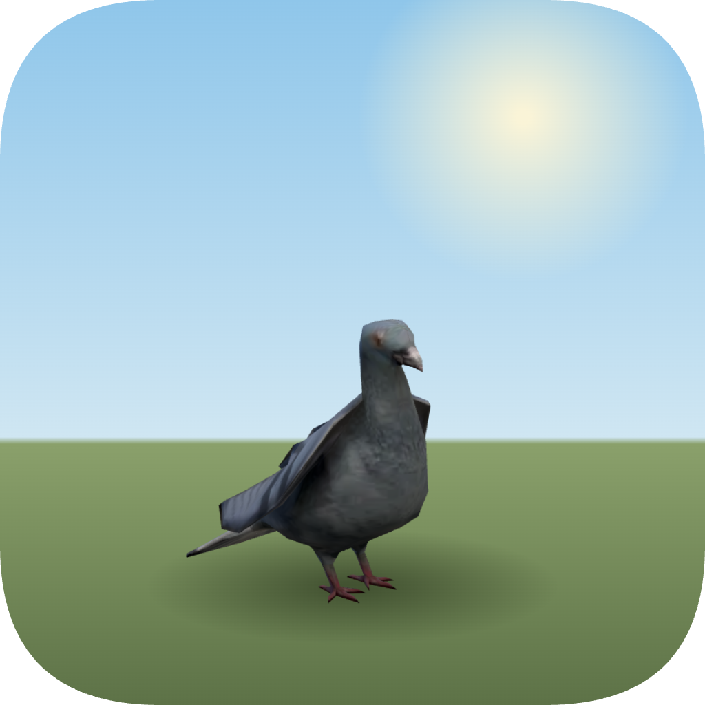
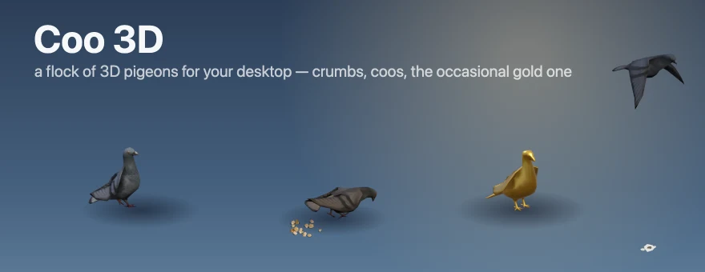

# Coo 3D 🕊️





**⬇ Download:** [coo3d-0.1.0.dmg](https://github.com/tarwin/tinyjsapp-examples/raw/main/_builds/coo3d-0.1.0.dmg) **(5.4 MB)** — prebuilt, signed & notarized; open and drag to Applications.

A flock of **two to twenty city pigeons** living on your desktop — each one a
skinned, animated 3D model (three.js) on its own frameless transparent
window, all steered by one backend brain. Where [kraa3d](../kraa3d/)'s
ravens are clever and learn to trust you, pigeons are… pigeons: they wander
alone or drift into pairs that never really stick, puff up and strut circles
at each other (the audience is unimpressed 40% of the time and leaves), fly
off to loaf on the edge of the screen, mob thrown crumbs, and poop. The poop
stays. There's a broom in the tray.

Animated pigeon from [AnimalMesh3D](https://www.patreon.com/cw/AnimalMesh3D)

```sh
tinyjs dev      # run with hot reload
tinyjs build    # package dist/Coo 3D.app — a whole flock in ~7.5 MB
```

Throw crumbs from the 🕊️ menu-bar item or **⌃⌥C** — each throw lands at a
random spot, up to three piles can be out at once, and the flock trots (or
flies) in to crowd them. Everything is **permanently click-through**: birds,
crumbs, poop — the flock lives on your screen but can never trap your mouse,
so the tray menu is the whole interface:

- **➕ / ➖ pigeon** — grow the flock to twenty or shrink it to two, live. A
  new arrival flies in from the screen edge. **🧼 Fresh start** resets it
  all: two pigeons, crumbs and poop swept, everyone flies somewhere new.
- **🖥️ Live on the desktop** — `setLevel('desktop')` drops the flock behind
  every window, onto the wallpaper itself; off restores floating-above.
- **🌱 Grounded** — standing, walking, and landing keep to a strip along the
  screen bottom; the sky above stays open for flying (crumbs land low too).
- **🔊 Coo out loud** — a 21-recording voice bank (coos from one to five
  beats, alarm calls, wing flaps, a takeoff, and a long distant-cooing
  ambience) rides along as base64. Every sound is picked by *kind*: regular
  coos are short sequences, the **circle-strut gets the full 4×/5× courtship
  coo**, a spooked bird gets an urgent flap-away plus an alarm call, casual
  flights get a takeoff flap — and while somebody's loafing on an edge, the
  distant city coos back very quietly every couple of minutes. Each play
  gets a random volume, pitch jitter, and a stereo pan matching the bird's
  spot on the screen. **Only the main window decodes and mixes** — one
  AudioContext for the whole flock, not twenty copies of the bank.

## ✨ The special ones

Each launch, every pigeon rolls for a rare coat — shiny-Pokémon rules, a few
percent in total, so most flocks are honest gray and then one day there's a
**gold** one. Metallic **gold / silver / bronze** (the feather texture is
dropped and a tiny canvas-painted equirect environment map is added, so the
metal has something to reflect), lacquered **blue / red** (tinted over the
feathers with a faint glow), and the rarest of all: a **rainbow** one that
cycles hue continuously and is never the same color twice.

## The pigeon society

The backend (`src/main.js`) runs one 25 fps tick over up to **31 windows**:
twenty pigeons, three crumb piles, eight poop splats (poop windows pool — the
ninth poop recycles the oldest splat). The state machine per bird: idle,
walk, peck, coo, circle-strut, poop, fly, land, eat, loaf.

- **Pairs never stick.** A loner sidles over to another loner; they potter
  around together, coo back and forth, and after 20–60 seconds drift apart —
  sometimes one flies straight off to loaf about it alone on a screen edge.
- **The cursor is weather.** Pigeons track cursor *speed* over FFI
  (CoreGraphics `CGEventGetLocation`): an ambling mouse makes a nearby bird
  waddle aside; a fast one scatters it — and panic is contagious, birds near
  a spooked bird go up too.
- **Crumbs beat everything.** Any number of birds crowd a pile, each on its
  own bearing around it; eating pigeons are brave and barely flee. Also,
  eating… accelerates digestion. The splat appears mid tail-lift.

## The 3D part

Same pipeline as [kraa3d](../kraa3d/README.md) (headless Blender export to
GLB, esbuild-bundled three.js, everything base64-inlined), but this model
needed **no faking**: it ships eleven real clips, so take-off is the actual
`TakeOff` clip handed off to `FlyLoop` when it finishes, touchdown is a real
wings-out `Land`, the courtship strut is `Circle` (its root *rotation* is
kept while root translation is pinned — the window is what moves), and the
voice animation is `Cooing`. The one procedural bit is the poop squat: after
the mixer poses the skeleton each frame, the tail bone lifts and the hips
tip forward on a little envelope (this rig hinges on local Z — found by
screenshot grid, same technique as the crow). Travel yaw, banking, the
shared screen-space sun, dark-mode light boost, and y-sorted pseudo-depth
(`show()` back-to-front as birds cross) all carry over from kraa3d — though
this rig's forward is **+Z** where the crow's was −Z, a fact worth one
debugging session. The contact shadow lives **in the scene** (a gradient
blob on a ground plane, glued to the hip bone's world position every frame)
rather than in CSS, so it stays under the feet through pecks, struts, and
turns, and fades away on the wing.

One multi-window lesson: pass `chrome` (and `x, y`) **in `app.openWindow`
itself** — they're applied before the first paint. Calling `setChrome`
from the new window's boot is too late, and a frameless transparent pet
flashes in as a white default window.

Crumbs and poop are canvas 2D, drawn to match the 3D lighting: crumbs are
irregular shaded polygons lit from the flock's virtual sun with contact
shadows, scattered gaussian-ish so every throw looks thrown; the splat is
layered irregular blobs with the classic olive center. Both pages are tiny
pooled windows the backend shows, moves, and hides.

Not affiliated with anyone; the pigeon model is from a purchased asset
bundle and ships here re-encoded for size.
