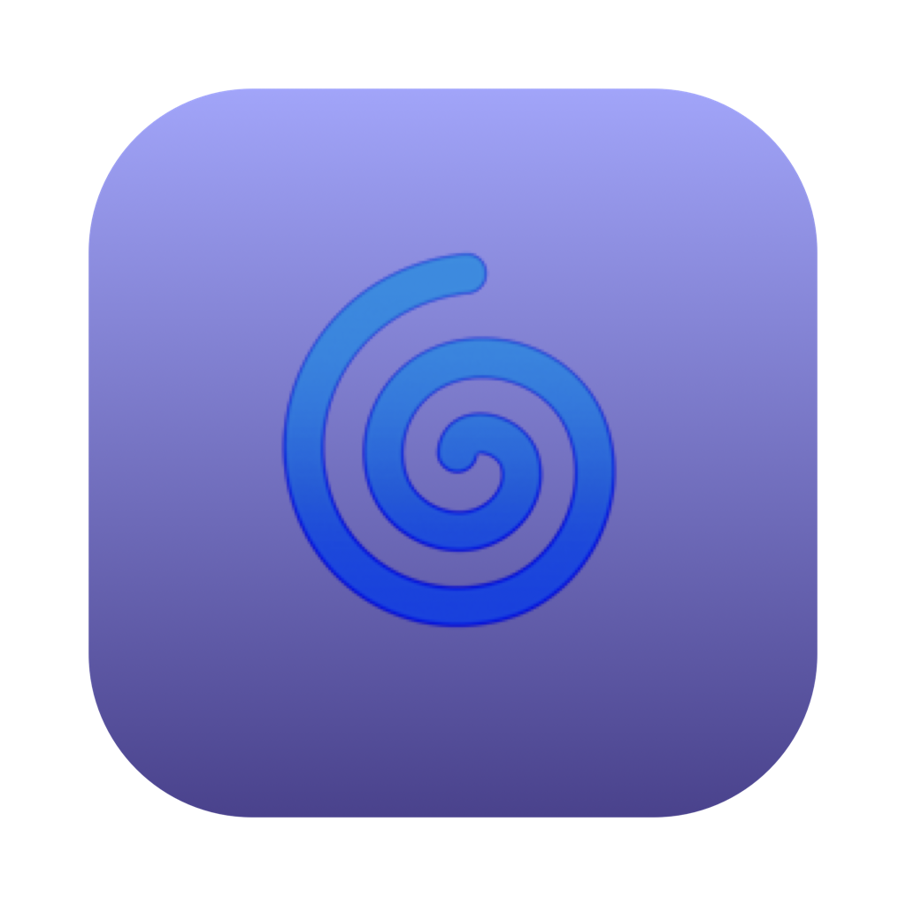
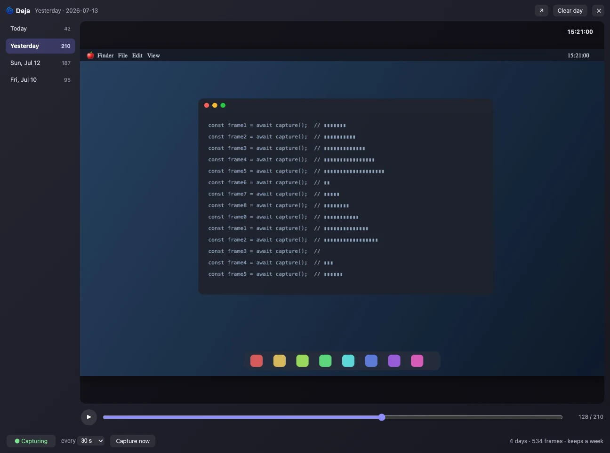

# Deja 🌀





**⬇ Download:** [deja-0.1.0.dmg](https://github.com/tarwin/tinyjsapp-examples/raw/main/_builds/deja-0.1.0.dmg) **(4.0 MB)** — prebuilt, signed & notarized; open and drag to Applications.

Your workday on a scrub bar — plain JavaScript, zero dependencies, and the
tinyjs 0.12 **Screen Recording** recipe.

A menu-bar agent quietly screenshots your screen every 30 seconds. Open the
window (click the 🌀 tray icon) and slide back through the day like a
flipbook: a sidebar of days, a big preview, and a scrubber — **space** plays
(~11 fps: an hour of your day flies by in ~10 s at the default interval),
**← →** step frame by frame, and while you sit on the newest frame the view
**follows live** as new captures land. The big preview is a real jpg —
**drag it out** of the window to drop that moment anywhere.

Everything stays local: frames live in Application Support as
`days/<date>/<time>.jpg`, days older than a week are pruned on launch, and
**Clear day** deletes a day on the spot (native confirm). The tray menu runs
the show even with the window closed: ✓ Capturing, Every 10 s / 30 s /
1 m / 5 m, Capture Now.

The interesting parts:

1. **Screen Recording onboarding** — `app.permissions.check('screen')` gates
   the whole capture loop: without the grant `screencapture` just fails
   ("could not create image from display"; older macOS silently shoots
   wallpaper-only). The gate screen calls `request('screen')` and keeps
   polling `check()`, so it dismisses itself the moment you flip the switch
   in System Settings. Note `'screen'` reports denied-until-granted — there
   is no `'undetermined'` (`CGPreflightScreenCaptureAccess` is a boolean).
2. **The capture loop lives in the backend** — a 1 s heartbeat spawns
   `screencapture -x` on schedule and `sips` shrinks each frame to 1280 px
   (a day is roughly 100 MB at 30 s). The window can stay closed all day.
3. **Frames cross the bridge on demand** — one data URI per `frame` call,
   with a small LRU in the page and prefetch around the playhead, so
   playback stress-tests JSON-RPC throughput instead of hoarding the day in
   memory. Each capture pushes to the open window for the live-follow mode.
4. **The tray is the app** — `"activation": "accessory"`, stateful checked
   menu items repainted on every change, settings persisted with
   `tiny.store`, and a frameless `"vibrancy": "hud"` window (title bar drag
   via `win.startDrag()`, esc hides).

Day and frame names the page sends are regex-validated so nothing ever
resolves outside the days folder.

```sh
tinyjs dev      # run with hot reload
tinyjs build    # package dist/Deja.app
```

Frames live in `~/Library/Application Support/com.example.deja/days/`
(newest 7 days).
