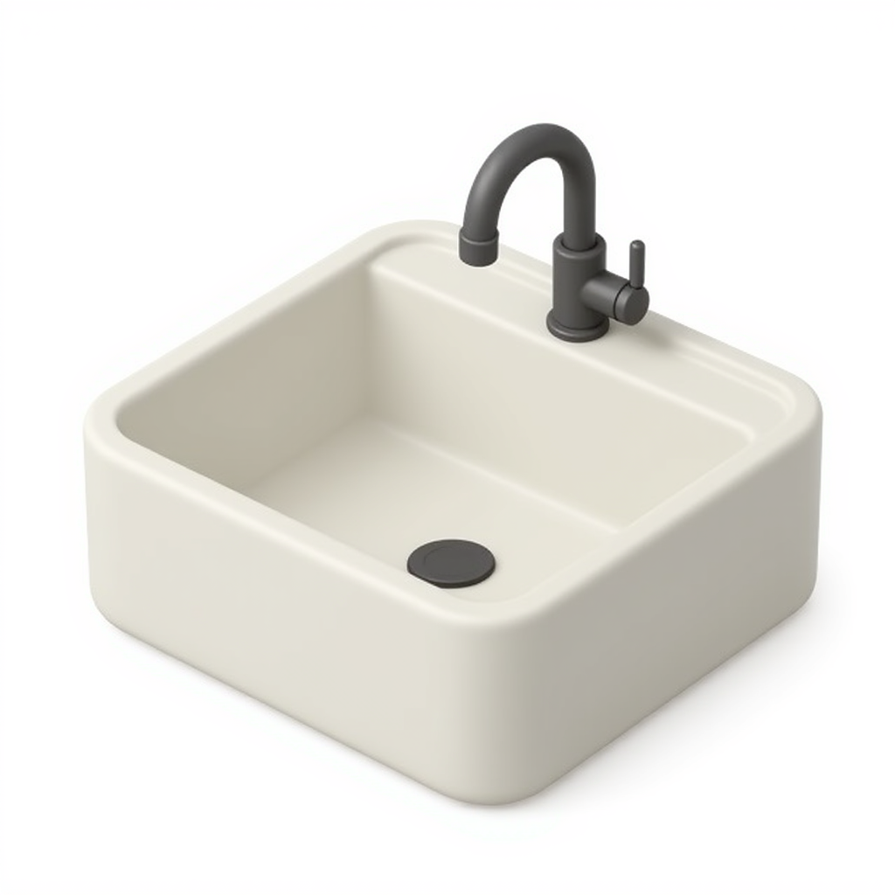
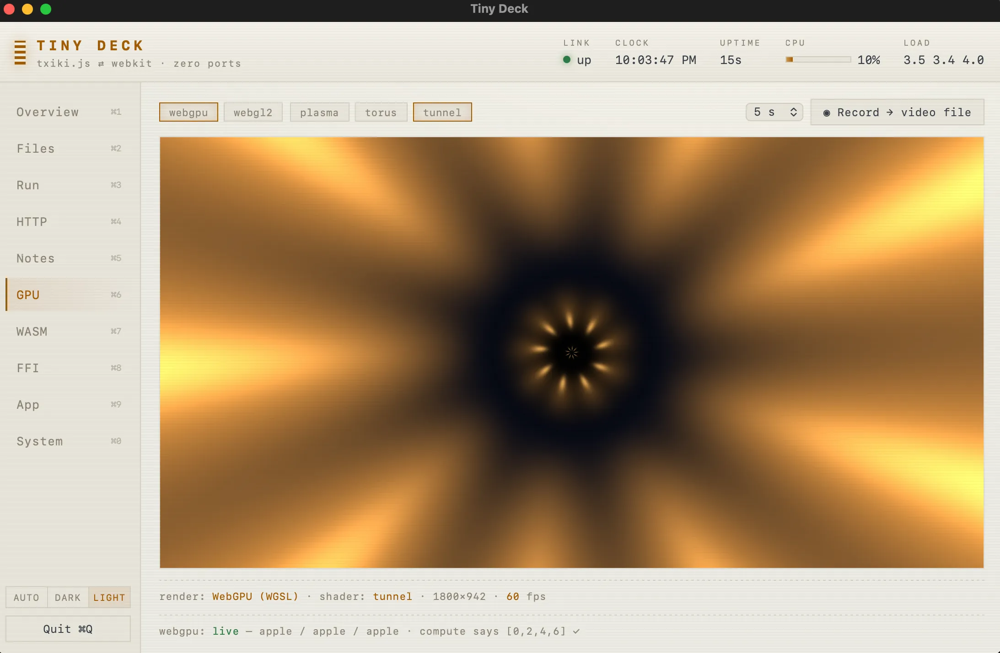

# Tiny Deck 🎛





**⬇ Download:** [kitchen-sink-0.17.0.dmg](https://github.com/tarwin/tinyjsapp-examples/releases/download/kitchen-sink-v0.17.0/kitchen-sink-0.17.0.dmg) **(5.6 MB)** — prebuilt, signed & notarized; open and drag to Applications.

The kitchen sink: one app that shows off the whole tinyjs API surface as a
deck of live demo cards.

Nine tabs, ordered the way you reach for them while building an app:

- **Overview (⌘1)** — live system readouts pushed from the backend, plus the
  native dialogs answered by the launcher.
- **App (⌘2)** — what the app *is*: window ops and `getState`, frameless
  chrome and window controls, a second native window sharing this backend,
  the tray, the app icon (badge / progress / attention), every `tiny.menu.*`
  surface (menu bar, read-back, right-click), notifications with action
  buttons, and shipping — updates, deep links, `launchAtLogin`.
- **Storage (⌘3)** — where the data goes. A file browser with an editable
  text view and a `tjs.watch` change feed; notes in the built-in **SQLite**
  (`tjs:sqlite`, no native module to build); and `tiny.store` next to
  `app.paths` — with a card on which of the two stores to reach for, since
  picking wrong is something you only notice later.
- **Desktop (⌘4)** — `app.shell` open/reveal/trash + Quick Look, Spotlight
  search, **AppleScript** in-process, the native **share sheet** anchored at
  the click, printing with and without the dialog (`win.print` /
  `win.printToPDF`), the **clipboard** (what's on it, and a watcher that shows
  the difference between the OS's change counter and what your page was told),
  the system eyedropper, and `screens()` + `captureScreen` (with its
  permission-reject story).
- **System (⌘5)** — split by direction rather than by subject. *Reading the
  machine*: os/arch/capabilities/requirements, live `battery()` / `wifi()`,
  `idleTime` / `frontmostApp`, the native theme. *Asking the OS*:
  `preventSleep` with the sleep/wake events it can't stop, and a global
  hotkey.
- **Media (⌘6)** — `beep` / `playSound` (four portable names vs this
  platform's own) and **native audio filters**: a real EQ applied below the browser, with an honest read-out of
  whether the chain is actually engaged.
- **GPU (⌘7)** — the WebKit window is a real browser: WebGL2 and WebGPU
  shaders side by side, including a compute demo that finds how many
  particles it can hold at 60 fps.
- **WASM (⌘8)** — a hand-assembled module with no toolchain, a JS-vs-WASM
  benchmark that runs on either side of the bridge, and animated fractal
  noise you can switch between implementations live.
- **Misc (⌘9)** — the escape hatches: shell commands streamed to the page as
  they print, `fetch` from the backend, and `tjs:ffi` dlopening system
  libraries to call C directly (`sysctlbyname`, a zlib roundtrip with
  timings).

Every panel is searchable (**⌘F**), and the **call log** in the header records
every `tiny.*` call the deck makes as you click — so the deck doubles as its
own reference: play with a control, read the call you'd have to write. It
opens with what **tinyjs.json** declared, read back at boot: the version, the
window size, the url scheme, the file types, the permissions this app asks
for. **Undock ⧉** moves the log into its own native window — and since no
window can read another's memory, it gets there the way everything crosses
between windows: through the backend.

```sh
tinyjs dev      # run with hot reload
tinyjs build    # package dist/Tiny Deck.app
```

It also registers a `tinydeck://` URL scheme and claims `.txt`/`.md`/`.log`
files, so `open -a "Tiny Deck" ~/Desktop/notes.txt` (or a Finder double-click)
lands in the Files tab.
