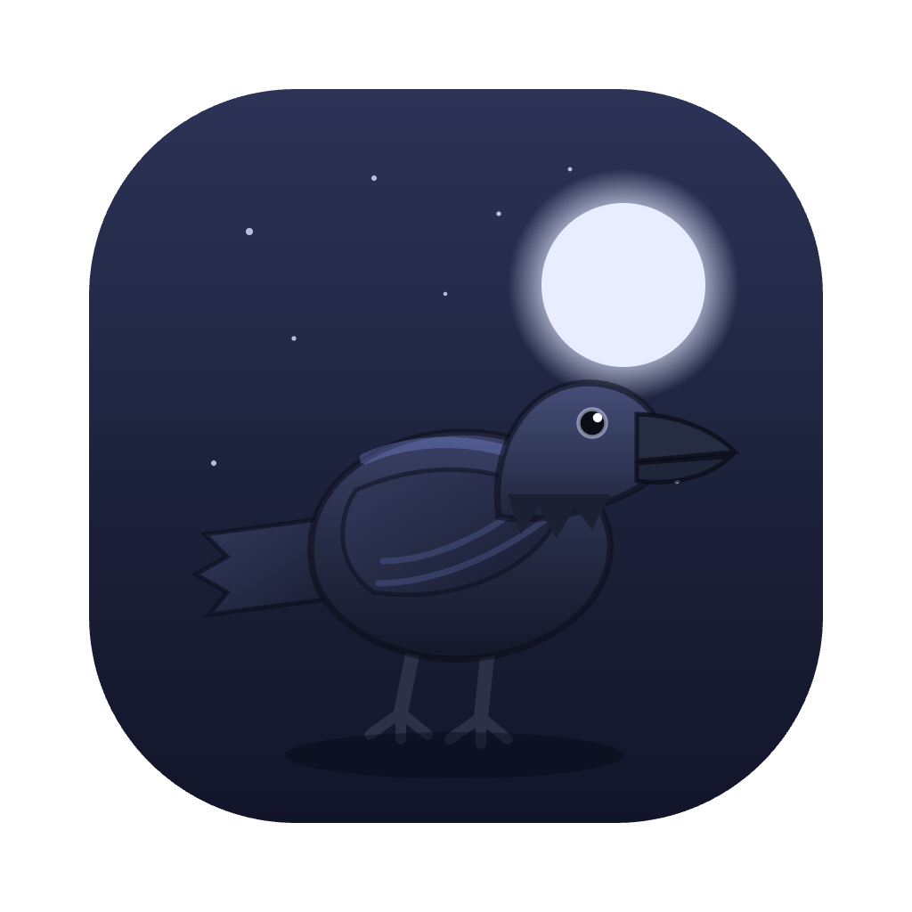
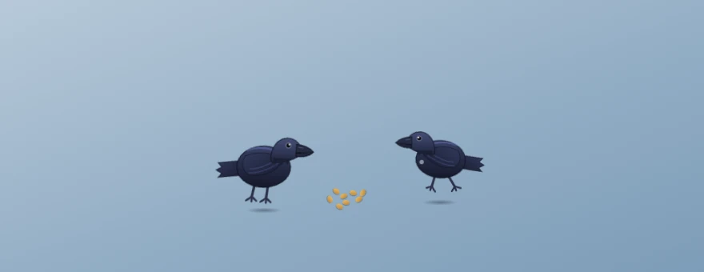

# Kraa 🐦‍⬛





**⬇ Download:** [kraa-0.1.0.dmg](https://github.com/tarwin/tinyjsapp-examples/raw/main/_builds/kraa-0.1.0.dmg) **(4.4 MB)** — prebuilt, signed & notarized; open and drag to Applications.

Two ravens loose on your desktop — Huginn and Muninn. Plain JavaScript, zero
dependencies.

Each raven **is** a frameless transparent window that walks itself around the
screen: they strut, peck at nothing, preen, hop, and caw at each other (one
raven's *kraa!* usually gets an answer). Get your cursor too close and they
take wing — a proper scared getaway, fast wingbeats and all — and when the
ground gets boring they'll take a lap of the screen just because.

Scatter seed for them (the 🐦‍⬛ menu-bar item, right-click a raven, or **⌃⌥S**
anywhere): a little pile appears at your cursor, the flock flies in — each
bird takes a side — and pecks it empty. Every finished pile grows a persistent
**trust** stat (★☆☆☆☆ in the menu). Trusted ravens keep less distance, and once
trust reaches two stars they'll sometimes start *following your cursor around*
— pottering along behind it, drifting off to peck at things, catching up again.
They're ravens, not retrievers. Click one: a fed, trusting bird takes it as a
compliment; a wild one takes it as an ambush.

The techniques on show:

1. **Three windows, one brain** — the main window is Huginn; the backend opens
   Muninn (the same `index.html`) and the seed pile (`seed.html`) with
   `app.openWindow`. A single 25 fps tick steers everything: per-window
   `app.window(id).setPosition` moves each bird, and pushes are broadcast
   tagged with `who` so each page only wears its own state.
2. **FFI** — the global cursor position comes straight from CoreGraphics
   (`tjs:ffi` → `CGEventGetLocation`), no helper process, no Accessibility
   permission. Same trick as [boo](../boo/), kraa's spiritual housemate.
3. **A tiny flock** — both birds run the same state machine (idle / walk /
   hop / peck / preen / caw / fly / land / eat) with different dials: Muninn
   is bolder and quicker on the wing, and wears a chest patch so you can tell
   them apart. Strays wander back toward their mate, reaction times differ,
   and trust is shared flock-wide via `tiny.store`.

```sh
tinyjs dev      # run with hot reload
tinyjs build    # package dist/Kraa.app — a flock in 6 MB
```
