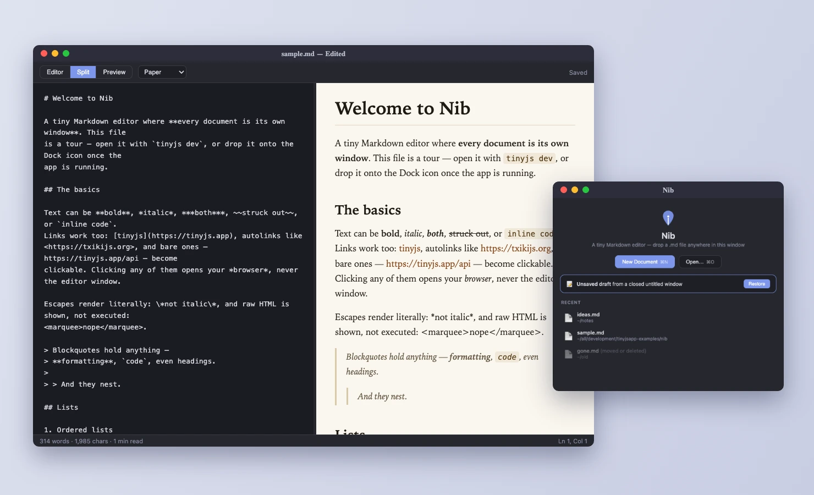

# Nib 🖋




**⬇ Download:** [nib-0.1.3.dmg](https://github.com/tarwin/tinyjsapp-examples/releases/download/nib-v0.1.5/nib-0.1.3.dmg) **(4.3 MB)** — prebuilt, signed & notarized; open and drag to Applications.

A tiny Markdown editor — one native window per document. Plain JavaScript,
zero dependencies, including the Markdown renderer.

The main window is a little Welcome screen (recent files and folders, a
dropzone, a draft-recovery card) that steps aside the moment you have a
document open and comes back when the last one closes — everything on it is
in the File menu too, **Open Recent** included. Bring it up any time with
**⌘0**; it resizes, and keeps the size you leave it at. Every `.md` you open gets a window with an
editor/preview split (**⌘1 / ⌘2 / ⌘3**, draggable divider, synced scrolling)
and a slide-in **outline** of the document's headings (**⌘⇧O**) that scrolls
the preview and moves the editor's caret together. Open files however you
like: **⌘O**, drop them on any Nib window, double-click them in Finder, drop
them on the Dock icon, or type `nib notes.md` — one handler answers all five
(see the bottom of this file). Preview themes (**View ▸ Preview Theme**: Paper, Ink,
Typewriter, Night) follow the document everywhere it goes: the live preview,
**Print** (**⌘⇧P**), **Save as PDF** and **Export as HTML**, which writes a
standalone themed file. So do the rest of the reading options — **Page
Width** (Narrow to Full), **Image Captions** (each picture's alt text printed
underneath), **Center Images** and **Click Image to Zoom** — because each one
is a class or a custom property on the article the exporter clones. With
Editable on, clicking a picture (or its caption) opens a small bar whose alt
field is live: type in it and the caption changes under your cursor. The app's own chrome is a
separate axis — **View ▸ Appearance**: Light, Dark, or Match System. Task-list checkboxes are clickable in the preview and edit the source
line.

Images can be pasted (**⌘V**), dropped, or picked (**⌘⇧I**), and
**Format ▸ Image & Path Settings…** decides what happens to them: *where* they land
(beside the document, in an `images/` folder next to it, or one at the project
root), *what a pasted one is called* — the document plus **the heading your
caret is under**, so a screenshot pasted under “Installing on macOS” becomes
`guide-installing-on-macos-1.png` — and whether they're **optimized** on the
way in. That last one is a canvas: decode, redraw at a capped width, re-encode.
No native tool is involved, because none exists on all three platforms (`sips`
is macOS-only) — and the format is probed rather than assumed, since WebKit
still has no WebP *encoder* on macOS even though it renders them happily, so
“Convert” honestly says JPEG there. SVG and animated GIF are never touched, and
a re-encode that comes out bigger than the original is thrown away (a 1.8 MB
screenshot became 133 KB; a four-pixel PNG kept its own bytes). The sheet shows
the exact path the next paste will write, and shows itself once — the first
time you paste into a folder — because a preference nobody discovers is not a
preference. **A picture dropped on a document is a paste**, at the point you
dropped it: the webview never sees the file (a native drop carries only paths)
but it does see the drag go past, so the last `dragover` is what moves the
caret. Only **Insert Image…** keeps the file's own name, because there you
picked it.

A target with a space or a parenthesis in it — `.png>)` —
is written in **angle brackets**, which is the only spelling that parses,
here or anywhere else. Nib reads that form now (it previously rendered the
whole thing as literal text), colours it, follows it, re-aims it on a rename
keeping the brackets, and *writes* it: a picture called `Screen Shot 2026.png`
dropped into a document comes out bracketed rather than broken, and the
editable preview serializes it back the same way.

The same sheet answers the other question a folder full of Markdown has:
**what a leading `/` means** — and it is two questions, not one. A site with
its sources in `src/` writes `[home](/index.md)` meaning `src/index.md`, and
`` meaning `src/assets/images/logo.png`. So there are two
roots, one for pictures and one for links, and they are used everywhere a path
is resolved: the preview's images, a followed link, and the rename rewriter —
which puts a root-relative link back **as** a root-relative link, re-derived,
rather than flattening it to `../../`. Both readings are always tried, mapped
first and the literal filesystem path second, so the mapping adds a meaning
instead of taking one away. And because these belong to the folder, the sheet
is also where you tick **Keep these in the folder** — the same switch as
File ▸ Save Settings in Folder, met where it makes sense: untick it and Nib
never reads or writes anything inside your folder.

Links are places to go. With Editable off a click in the preview follows one;
with the caret live in the preview — or over in the raw source, where every
click is a caret — **⌥-click** does it. Holding ⌥ marks the links in both panes
and gives the pointer a browser's hand over them, which in the source pane
takes some doing: a textarea has nothing to hover. The coloured backdrop
underneath does, though — `hl.js` wraps every link in a span carrying the
target it already parsed — so the pointer is hit-tested against those boxes
(the row found by binary search, because this runs on `mousemove`), and the
same span tells the click what it landed on. A `.md` or a picture opens as a
tab here, a `#heading` scrolls, `https:` goes to your browser, and a PDF or a
folder goes to whatever the system opens it with; a link pointing at nothing
says so rather than doing nothing.

**Find** (**⌘F**) is a bar over the document rather than a dialog, with
**⌘G / ⇧⌘G** to step, a live match count, **Aa**, whole-word and **`.*`** —
a real regular expression, groups and all, with `$1` usable in the
replacement. Replace unfolds underneath it (**⌥⌘F**), and both Replace and
Replace All go through the editor's own undo, so **⌘Z** takes a whole
Replace All back in one step. Every match is highlighted in the source at
once and the current one is picked out, which is the Custom Highlight API
again — the textarea can't hold a highlight, but the coloured backdrop under
it can.

**⌘⇧F** asks the same question of the whole folder. The file tree's panel
turns into the results: grouped by file, a line number and the matched line
for each hit, one click to preview a hit in place and a double-click to keep
it — and either way the editor lands **on** the match. **Replace All** there
writes to the files on disk after asking, skipping (and naming) any file with
unsaved changes rather than writing under your buffer; a file you have open
catches up on screen. There's no index and there doesn't need to be one — VS
Code doesn't keep one either, it shells out to ripgrep — so this reads the
folder's text files in a small pool of concurrent reads and scans them, which
for a folder of documents is milliseconds.

**File ▸ Open Folder…** (**⌥⌘O** — ⌘⇧F belongs to Find in Folder) turns a
folder into a project: its files get
a tree down the left of every document window (**⌘⇧B**, and with no folder
open that panel is where you choose one), and opening one puts
it in **that window as a tab** — a strip appears along the top once a window
holds two, with a dot for unsaved work, drag to reorder, ⌘W to close the tab
(the last one closes the window) and **⌘⇧N** for a window of its own. Windows
open at whatever size you left the last one.

The tree works like an editor's, without becoming one. A single click **previews**
a file — it opens in a tab you haven't committed to, and the next preview
takes the same slot, so reading through a folder leaves one tab behind
instead of thirty; the moment you change something, double-click it, or hit
**⌘⏎**, that tab is yours to keep (a preview tab is in italics). The whole
tree is keyboard-driven: **↑↓** move and show as they go, **←→** close and
open folders, **⏎** renames the file in place (with the extension left out of
the selection), and **esc** hands the keyboard back to the editor. Right-click
gives you rename, Reveal in Finder, copy the path or the relative path, and —
because this is a Markdown editor — **Insert Link Here**, which writes the
link into the document you're in. Renaming moves the open tab, its draft and
its place in your recents with it — and then asks the second question:
*“Update 4 links to `new.md`?”*, listing the documents that still point at the
old name. Say yes and they're re-aimed, pictures (``) as much
as documents, reference definitions (`[id]: old.md`) as much as inline links,
`#fragments` kept, and a renamed *folder* carrying its whole subtree. Links are
matched by where they RESOLVE, not by how they read, so `../notes/todo.md` is
found and an unrelated `todo.md` two folders away is not; code fences are left
alone; and a document you have open with unsaved changes is edited in its
buffer rather than written under you.

**Pictures open too.** A `.png` in the tree gets a tab like anything else, with
a viewer in place of the two panes (fit or actual size, its dimensions and file
size underneath) — and it renames from the same **⏎**, which is the part that
matters when the picture is one your document links to.

**⌘P** is Open Quickly over everything in the project — matched against each
file's path from the folder root, so folders narrow the list the way names do,
and a space starts another term that can land anywhere in it (`deep note` finds
`docs/deep/nested-note.md`; so does `dn`). Typing **`@`** in
either pane — source
or editable preview — brings the same picker up at the caret, inserting a
relative link, or the picture itself if you picked an image (Escape keeps the
`@` and carries on typing). Folders you've opened are listed on the Welcome
screen beside the recent files, with the current one badged. A project keeps
its own theme, view mode, reading options, image handling and path roots in
`.nib/settings.json`, written only when you actually change
one, and **File ▸ Save Settings in Folder** turns that off entirely — with it
unticked Nib never reads or writes anything inside your folder. That switch is
also a tickbox at the bottom of **Image & Path Settings…**, which is where you
are actually standing when the question comes up. Printing moved
to **⌘⇧P** to make room.

**Help ▸ Markdown in Nib** (**⌘⇧H**) is a reference window that renders its own
examples with the app's parser, so it can't drift from the editor; **Help ▸
Open Example Document** writes a full tour into the app's data folder and
opens it as an ordinary, editable file.

Turn on **✎ Editable** (**⌘⇧L**) and the rendered preview takes a caret. Type
`## `, `- `, `> `, `` `code` `` or `**bold**` and it becomes the real thing as
you finish it; select anything for a floating format bubble. Every pause
serializes the DOM back to Markdown into the editor pane — so in Split you can
work from either side of the divider at once.

Keeping those two views in step is the hard part of the app, and `sync.js` is
where it lives. Every rendered block knows the source line it came from; on
top of that, each block builds a lazy character map — the rendered text is
almost a subsequence of its Markdown, so a two-pointer walk gives a monotone
rendered→source index. That's enough to mirror a **selection to the
character**: select `**a phrase**` in the source and exactly that phrase
highlights in the preview, minus its asterisks — and it works in both
directions with or without Editable on, since selecting in a plain preview
doesn't move focus off the textarea and the mirror has to notice that. Source
that renders to nothing at all — an image's whole `` run, a link's
`](url)` tail — is blanked out before that walk, or a rendered letter would
happily match one inside an alt text or a url and drag the rest of the
paragraph a character out of step; and both ends of a selection resolve
outwards, so picking the word inside `*word*` never comes back with a star
attached.
Selections paint through the
CSS Custom Highlight API rather than wrapper spans, because the preview may be
contenteditable and a stray marker would end up in your document; carets are
measured with a collapsed Range and drawn as an overlay. Scrolling is anchored
block-to-block, never by ratio — and tabs are what make that necessary, since
a closed panel has source lines but no box at all, so anything geometric has
to climb to the nearest ancestor that's actually laid out.

Fenced code is coloured in the preview too (`code.js`: js/ts, json, python,
shell, css, html, sql, yaml, and a shared C-family lexer for go/rust/c/java/
swift) — classes only, so it survives export and print. The source pane is
syntax-coloured, which a `<textarea>` can't do by itself —
it's a transparent textarea over a rendered backdrop that has to wrap
identically, one `<div>` per line. That backdrop is also what the cursor bands
hang off. Put the cursor in the source of a hidden tab panel or a folded
`::: details` and the preview opens it to show you. With **✎ Editable** on,
clicking a picture gets you replace / alt text / remove. There's an emoji
picker in the toolbar (**⌘⇧J**), and beyond
callouts Nib renders `::: tabs` (split by `== Title` lines, switched by CSS
alone so exported HTML keeps working), `==highlight==`, and YAML front-matter
as its own quiet block instead of a rule and a paragraph.

The interesting part is **closing**. macOS gives an app no veto over the red
✗ — tinyjs's `onWindowClosed` fires *after* the window is gone — so instead
of pleading, Nib makes closing lossless: every edit is debounce-synced to the
backend, and a window that dies dirty leaves a draft in `tiny.store`. Reopen
the file and your changes are restored, banner and all. **⌘W** gets the
civilised three-button sheet (Save / Don't Save / Cancel), and an untitled
window that closes dirty comes back via the Welcome screen's draft card.

The techniques on show:

1. **One window per document** — the backend opens `doc.html` per file with
   `app.openWindow`, tells windows apart in api handlers via `meta.window`,
   and routes per-window control through `app.window(id)`. Menu events
   broadcast to every page; only the one with `document.hasFocus()` acts, and
   it re-asserts the View menu's checkmarks on focus so the radios follow the
   active window. The Welcome window never dies — `setHideOnClose` — it
   orders itself out while documents are up (`win.hide({ app: false })`, which
   is the one hide that doesn't take the whole app with it) and re-shows when
   the last one closes. Its two lists are also the File ▸ Open Recent submenu,
   which is why the menu bar is rebuilt with `setMenu` rather than patched —
   and why every checkmark it declares is mirrored in a `menuState` object.
2. **The dirty-state dance** — `api.sync` + `onWindowClosed` + `tiny.store`
   drafts, as above. `Save` is a two-step with the page (dialogs are
   page-side: `tiny.win.saveFile()` picks the path, the backend writes it).
3. **A safe hand-rolled renderer** — `md.js` covers the everyday Markdown set
   in ~300 lines, escapes *everything* (raw HTML is shown, never executed —
   the page holds an RPC channel with full system access), and vets URL
   schemes. Images with relative paths are served by the backend as `data:`
   URIs (`api.imageData`), so WebKit never touches `file://`; a followed link
   is resolved against the document's own folder and handed to `api.openLink`,
   which opens what Nib can show and lets the system have the rest. One
   extension rides along: `::: warning Title` … `:::` callouts, nestable,
   with `::: details` folding into a real `<details>`.
4. **Two panes, one position** — `sync.js`, as above: a block index, a lazy
   per-block character map, Custom Highlights and overlay carets for painting,
   and block-anchored scrolling. The rule throughout is that anything
   geometric must survive a subtree with no geometry.
5. **Two layers pretending to be one editor** — `hl.js` paints the coloured
   backdrop and `doc.css` keeps its metrics identical to the textarea's; every
   rendered block carries the source line it came from, which is what lets the
   outline jump and the two panes point at each other.
6. **A renderer that runs backwards** — `unmd.js` walks the preview DOM back
   into Markdown, which is what makes the editable preview possible: the
   textarea stays the document of record, written to from the other end.
   `live.js` adds the input rules and the selection bubble on top, doing its
   own DOM surgery rather than trusting `execCommand('formatBlock')` — that
   one loses the caret exactly when you need it, on an empty line.

**Nib is a command, too.** `tinyjs build --cli nib` writes `dist/bin/nib` beside
the app — a two-line shim onto the built binary — and once it's on your PATH:

```sh
nib notes.md            # opens it, in the copy that's already running
nib .                   # the folder becomes the project
nib . README.md         # both: the tree comes up with the file in it
```

That works because tinyjs 0.30 hands **argv to `onOpenFiles`** on all three
platforms, so the same handler answers the terminal, Finder, the Dock icon and
a drop on the window. Nib had one thing to add: a path that arrives from a
shell is not the shape the rest of the app compares against — `nib .` resolves
to `/work/notes/.`, and a project root with a dot on the end matches none of
its own files — so every incoming path is tidied first (`.` and `..` resolved,
separators normalised, which is also what makes Windows' backslashes land in a
codebase that cuts paths on `/`). Arguments that aren't paths are dropped
before they get here, so `nib --verbose` doesn't open a document called
`--verbose`.

A **folder** is a different verb from a file — "make this the project", not
"open this document" — and it now arrives by every route, because
`"openFolders": true` puts `public.folder` in the bundle's document types
(`inode/directory` in the `.desktop` on Linux). So dropping a folder on the
Dock icon, "Open With ▸ Nib" on a folder, and `nib .` all mean the same thing.

Double-clicking a `.md` file has always worked once Nib is built —
`"fileExtensions": ["md", "markdown"]` claims the type — but being *in* the
Open With list is not the same as being the *default*, and that switch is the
user's to throw. **File ▸ Open .md Files with Nib…** does what each platform
allows: Linux has a command (`app.setAsDefaultHandler`), macOS and Windows
answer `'unsupported'` on purpose, so Nib says plainly where the switch is
instead of pretending to have thrown it. It's a menu item and not a question on
first launch, for the same reason tinyjs won't do it automatically — an app
that claims `.md` the moment you open it is an app you uninstall.

```sh
tinyjs dev             # run with hot reload — then Help ▸ Open Example Document
tinyjs build           # package dist/Nib.app
tinyjs build --cli nib # …and dist/bin/nib, for the terminal
ln -sf "$(pwd)/dist/bin/nib" /usr/local/bin/nib
```
