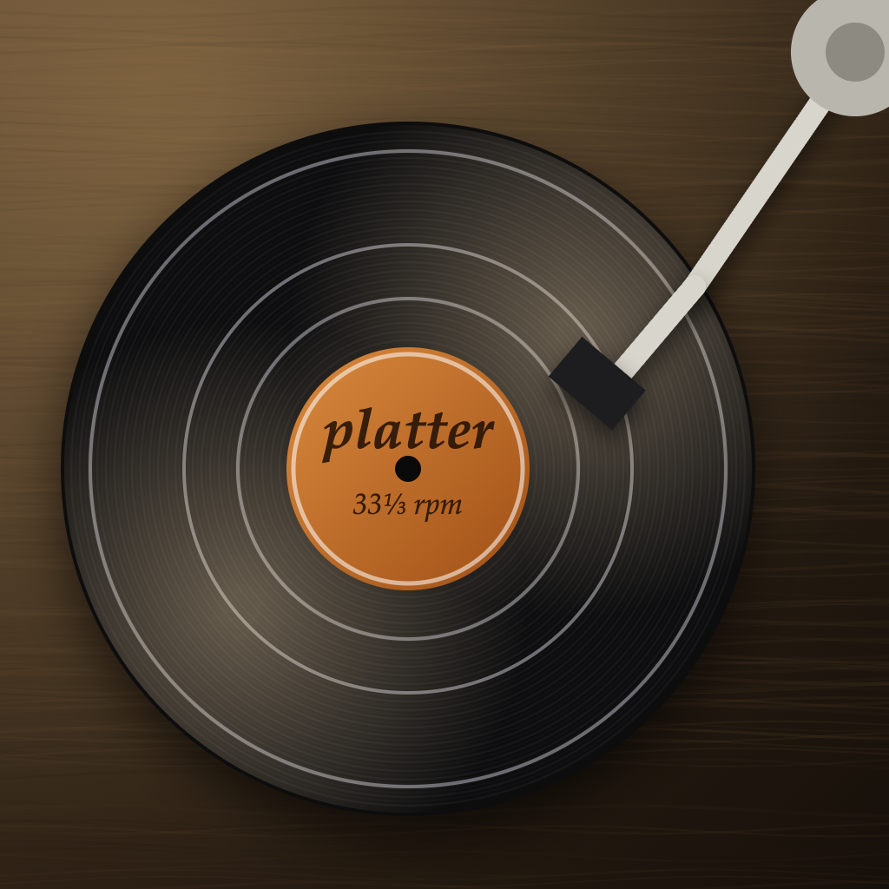
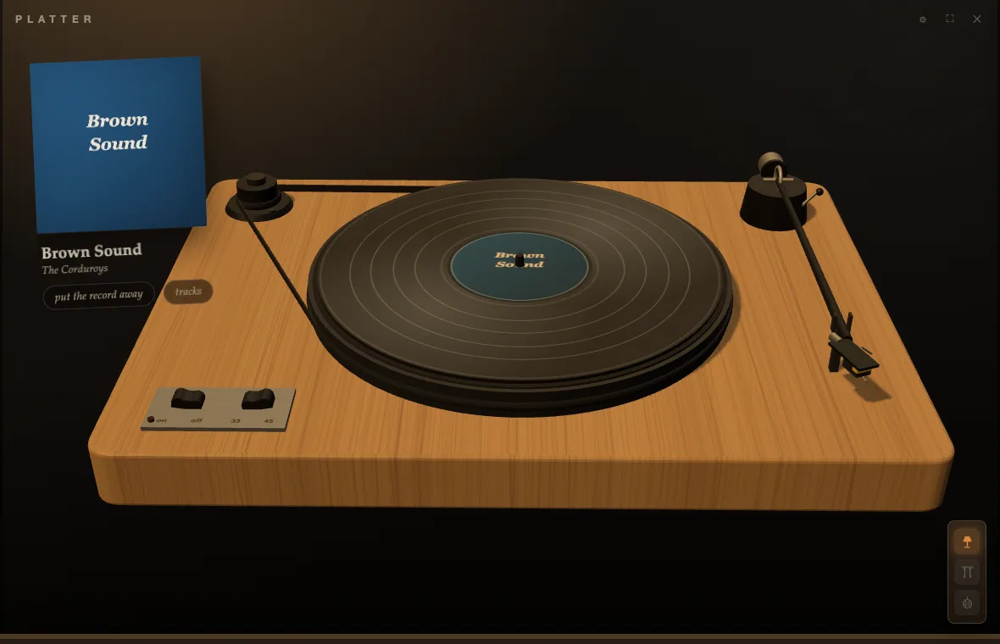

# platter 🎵





**⬇ Download:** [platter-0.2.1.dmg](https://github.com/tarwin/tinyjsapp-examples/raw/main/_builds/platter-0.2.1.dmg) **(6.2 MB)** — prebuilt, signed & notarized; open and drag to Applications.

**A record player, not a music player.** Platter plays albums, one side at a
time, and everything about it is deliberately slow.

No music folder yet? A **sample record ships on the deck** — a single Opus
track (bundled in the app, with its own cover art) that you can spin straight
from the welcome screen before pointing platter at your own library. It stays
reachable afterward from the right-click ⚙ menu → *spin the sample record*.

Point it at your music folder (or drop one on the window) and the scanner
reads it like a person would: `Artist/Album/` trees, `Artist - Album`
folder names, `1997 - Album` year prefixes (stripped), `CD1`/`Disc 2`
folders **merged into one LP**, an artist's stray files as their *Singles*,
and loose tracks in the root as *Loose Records*. When the folders don't say
who the artist is, the first track's **tags** get the vote (ID3, FLAC and
M4A text frames, parsed in the txiki backend). Cover art comes from
`cover.jpg`-style files or gets dug out of the tags themselves (ID3 APIC,
FLAC pictures, M4A `covr` atoms, thumbnailed through `sips`). Then the
ritual begins:

1. **Pull a sleeve** from the crate, **slide the record out**, and it floats
   onto a **three.js turntable** — U-Turn-style light oak plinth, black felt
   mat, an **exposed belt drive** (real tangent geometry to the corner
   pulley), a black straight tonearm resting along the right edge, and a
   brushed switch plate — all primitives and canvas textures, no models.
   The empty sleeve leans against the wall with the tracklist.
2. **Start the motor.** The pitch bends up from a groan as the platter comes
   to speed (`preservesPitch = false` riding `playbackRate`).
3. **Set the needle down yourself** — grab the tonearm, aim between the
   grooves (the track gaps are drawn at their real radii), and let go. The
   cue lever eases it down; where it lands is where the music starts. There
   is no skip button. Two tracks apart is a steady-hand problem.
4. When the side runs out, the arm nods in a **crackling lead-out groove**,
   thumping once per revolution until you lift it. **Flipping to side two**
   requires the motor stopped and the needle up — manners are enforced.
5. Want a different album? **Put this one away first.**

The audio never crosses the bridge: `readAccess` lets the page stream
tracks straight off disk as `file://` into a WebAudio graph, with a
procedural crackle bed (sparse pops + dust hiss) that follows the stylus.
Sides are split where half the runtime falls; the side-B label is generated
from the album's dominant colour. And yes, there's a **45 rpm switch**, for
when an LP deserves to be a chipmunk record.

**Records with no art get dressed online**: MusicBrainz → **Cover Art
Archive** (which has typed *front and back* sleeve scans — click the
leaning sleeve to turn it over), falling back to iTunes Search and Deezer
for fronts. All keyless, all cached, MusicBrainz throttled to its polite
1 req/s. The tonearm got the fidelity pass too: gimbal, tapered tube,
offset headshell with cartridge and cantilever, an **amber landing ring +
stylus dot** while you carry the arm, and a slight magnetic pull toward
track starts (strongest on the lead-in). Grooves catch the light through a
generated **normal map**; the flip pulls the record out toward you before
turning it over.

**The room is furnished**: time-of-day lighting (daylight through the
window, evenings go amber, night is lamp-lit), a wall plate with a **lamp
switch**, **curtains** (cancel daytime, keep the mood), and a **disco
switch** whose consequences are your own fault.

**The shop** (⚙): dress the deck your way — **two models** (the U-Turn-ish
belt-drive *orbit*, or an SL-1200-style *1200* in brushed silver with the
strobe-dot platter rim, S-arm, START·STOP and a pitch fader that winks at
45), **eight bases** (oak and walnut grain, or painted black / white / red /
blue / green / silver), and **six platters** — five felt colours or the
**clear acrylic** with its light-catching edge. All primitives and canvas
textures still; your choices persist.

**Spotify Connect** (⚙ → sources): platter is the turntable, Spotify is
the amplifier. Paste the client id of your own (free) Spotify app — with
redirect URI `http://127.0.0.1:8898/callback` — connect via PKCE (a tiny
`tjs.serve` loopback catches the callback; no secret, tokens in the app
store), and your **saved albums join the crate** with a green dot. The
ritual is identical: needle drops become `position_ms` seeks, the motor
pauses and resumes the remote, run-out pauses it for good — while the
crackle bed and the spin-up stay local, because the turntable is ours.
Playback needs Premium and Spotify open somewhere; spin-down pitch-sag is
the one thing a remote amplifier can't do.

Packaged builds **keep themselves current**: tinyjs' native updater checks
`_builds/platter/manifest.json` daily (sha256 + code-signature verified,
same rig as shelf) and offers an amber *update & relaunch* pill in the top
bar — which politely lifts the needle and pauses the amplifier first.

```sh
tinyjs dev      # run with hot reload
tinyjs build    # package dist/Platter.app
```
