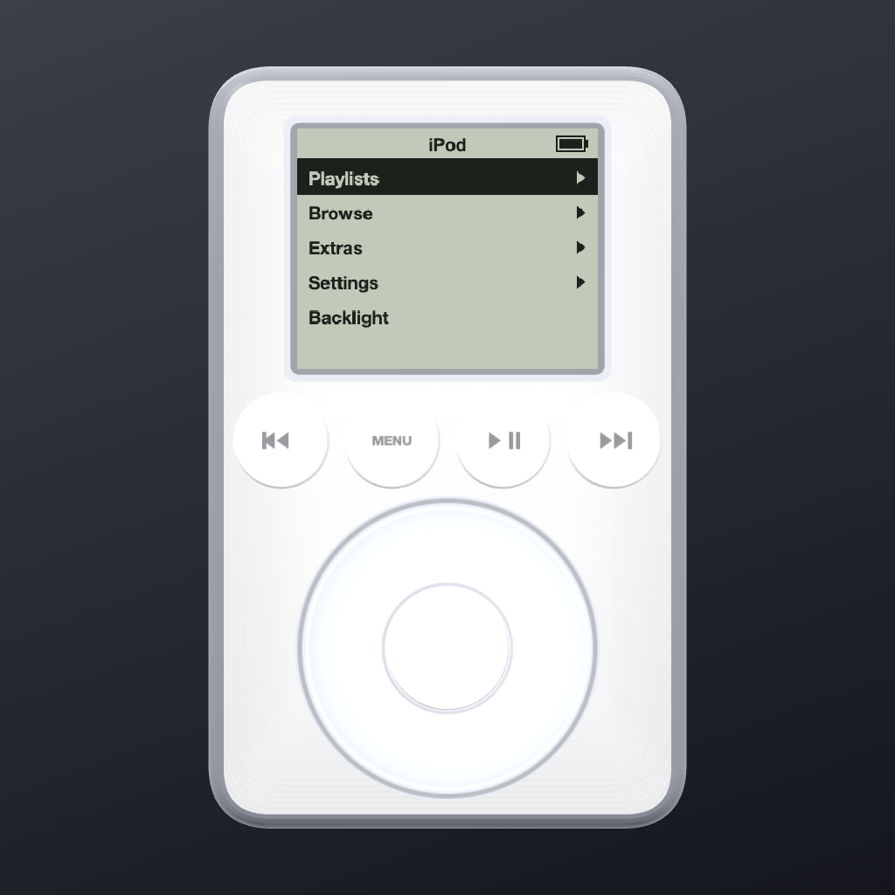
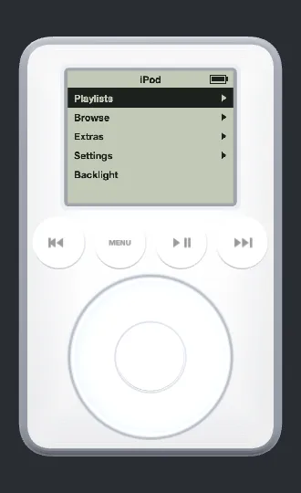

# podd 🎧





**⬇ Download:** [podd-0.1.1.dmg](https://github.com/tarwin/tinyjsapp-examples/raw/main/_builds/podd-0.1.1.dmg) **(4.7 MB)** — prebuilt, signed & notarized; open and drag to Applications.

**A 2003 iPod, floating on your desktop.** The third-generation one — the
row of four touch buttons, the touch wheel, the buttons that glow
red-orange when the backlight comes on. All of it modeled in three.js on a
transparent always-on-top window: the device IS the widget, and grabbing
its body drags it around your screen.

The firmware is the point. A monochrome LCD (a canvas texture,
nearest-filtered so the pixels stay chunky) runs the real menu tree:
**Playlists · Browse · Extras · Settings · Backlight**. You scroll with the
**touch wheel** — circular drags, with the Clicker ticking — the centre
button descends, **MENU climbs back out**. Browse by Artists, Albums, or
Songs; pick one and you land in **Now Playing**: "3 of 12", three lines of
text, a progress bar. The wheel there is **volume**; press the centre
button and it becomes a **scrub bar** with the diamond thumb. Hold ⏮/⏭ to
seek. Settings has Shuffle, Repeat, Clicker, and a **Backlight Timer** —
any touch lights the cold blue LCD, and it times back out to STN green.
The mouse scroll wheel also spins the touch wheel, because your Mac has
one and 2003 would have been jealous.

No album art anywhere. The 3G's screen was monochrome and proud of it.

The backend is platter's library scanner with the sleeves torn off —
folder-shape heuristics plus ID3/FLAC/M4A text tags — and on first run it
**borrows platter's music folder** if the sibling app is set up. Otherwise:
iPod menu → Choose Music Folder.

```sh
tinyjs dev      # run with hot reload
tinyjs build    # package dist/podd.app
```
