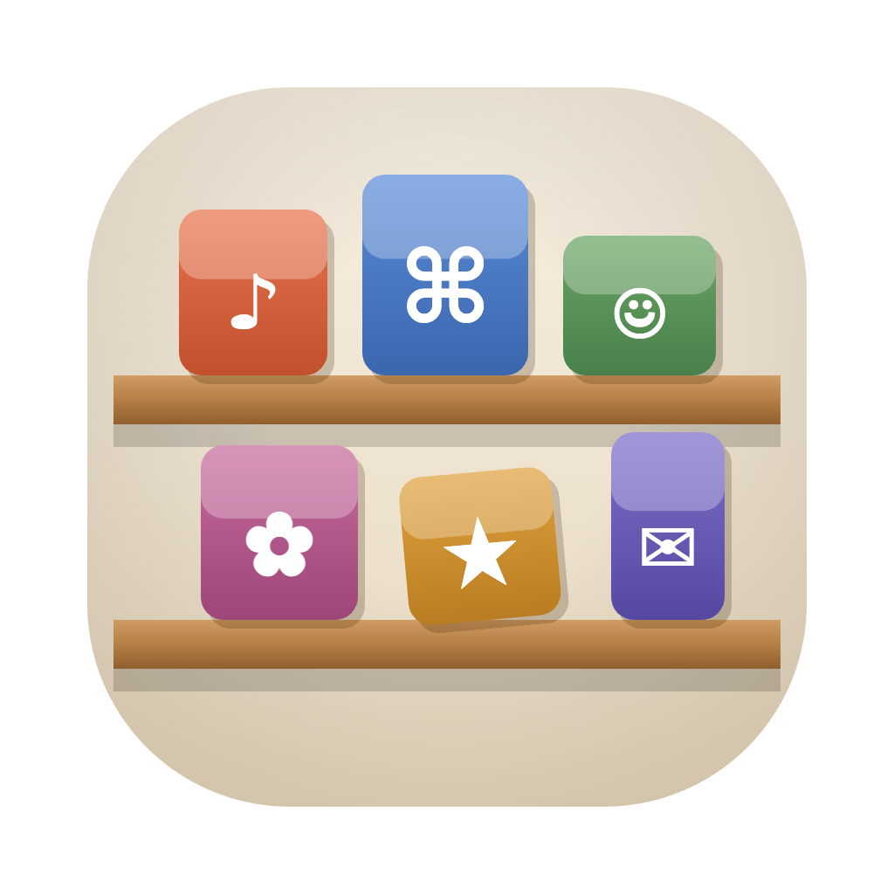
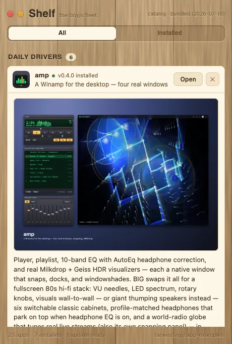

# Shelf 🗄️





**⬇ Download:** [shelf-0.1.0.dmg](https://github.com/tarwin/tinyjsapp-examples/raw/main/_builds/shelf-0.1.0.dmg) **(4.6 MB)** — prebuilt, signed & notarized; open and drag to Applications.

An app store for this repo, built like a piece of furniture: a frameless
window of wood (sunny pine in light mode, moody walnut in dark — CSS
gradients for the planks, an `feTurbulence` SVG for the grain, engraved
lettering, hand-drawn traffic-light dots on a `data-tiny-drag` strip). Every
example is sorted onto labelled shelves — **daily drivers**, **UX
experiments**, **desktop toys**, **API showcases** — with one-click install,
open, update, and uninstall. Plain JavaScript, zero dependencies.

Two tabs: **All** is the browsing list; **Installed** is just your icons
standing on wooden shelves — click to launch, hover for the ✕, an ↑ badge
when an update is waiting.

Click a row and it unfolds: screenshot, the full pitch, a link to the app's
README. The install button downloads the app's signed & notarized dmg
straight from this repo's `_builds/`, mounts it, copies the `.app` into
`/Applications`, and unmounts — the same drag-to-Applications you'd do by
hand, minus the hand. The **✕** quits the app and uninstalls it, with an
optional checkbox to delete its settings folder too. If an installed copy is
older than the catalog's version, the button becomes **Update**. (Shelf
itself stays out of its own catalog — the store doesn't stock itself.)

And it stays honest without polling you can feel: a kernel watcher on
`/Applications` (`tjs.watch`) re-scans the moment anything appears or
disappears — drag an app to the Trash yourself and its row flips back to
**Install** in under a second. The catalog re-fetches every 15 minutes, and
when an installed app has a newer release, Shelf posts a desktop
notification and the footer counts the updates waiting.

How it works:

1. **The catalog** is [`catalog.json`](../catalog.json) at the repo root,
   generated by [`gen-catalog.js`](gen-catalog.js) from every app's
   `tinyjs.json` + the root README, and fetched live from GitHub after
   launch and every 15 min — so a fresh release or a brand-new app shows up
   in Shelf (and triggers the update notification) without shipping a new
   Shelf. A bundled copy paints the first frame and is the offline fallback
   (the header says which one you're looking at).
2. **Install** is `fetch` (streamed, with a real progress bar over
   `content-length`) → `hdiutil attach` → `ditto` → `hdiutil detach`, all
   from the backend via `tjs.spawn`.
3. **Safety rails** — before touching anything in `/Applications`, Shelf
   reads the target's `Info.plist` and only proceeds if the
   `CFBundleIdentifier` is the expected `art.tarwin.*` id. A `Boo.app` that
   isn't *our* Boo.app gets a "name taken" badge and is left alone. Download
   URLs are pinned to this repo, and Shelf refuses to uninstall itself.
4. **Installed detection** is `plutil -extract` over each app's
   `Info.plist` (tinyjs stamps `CFBundleVersion`), plus a `pgrep` for the
   running dot next to the name.

```sh
tinyjs dev      # run with hot reload
tinyjs build    # package dist/Shelf.app — a 4 MB app store
```
