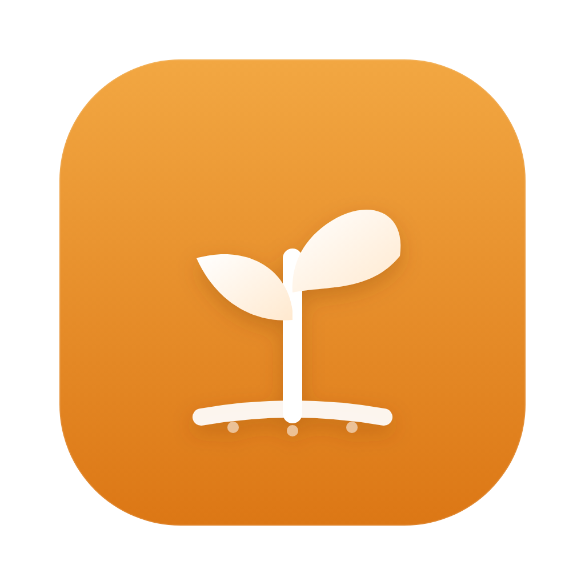
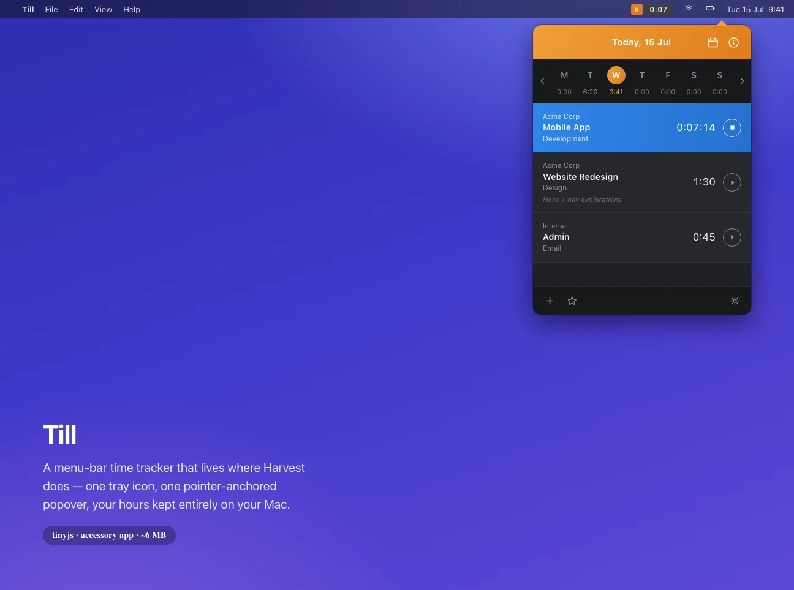

# Till 🌱





**⬇ Download:** [till-0.1.0.dmg](https://github.com/tarwin/tinyjsapp-examples/raw/main/_builds/till-0.1.0.dmg) **(3.9 MB)** — prebuilt, signed & notarized; open and drag to Applications.

A menu-bar time tracker — a local, offline homage to
[Harvest](https://www.getharvest.com)'s macOS app. Plain JavaScript, zero
dependencies, and it lives exactly where Harvest does: **one tray icon** with a
live timer and **one popover** that drops from it.

*Till* — because you cultivate your hours, and because you track them *till*
they're done.

```sh
tinyjs dev      # run with hot reload
tinyjs build    # package dist/Till.app
```

There's no Dock icon and no window at launch — Till is an **accessory app**
(`"activation": "accessory"` in `tinyjs.json`). The menu-bar item works like
Harvest's: click the **▶ / ‖** glyph to start or pause the timer, click the
**time** to drop the popover (click away and it tucks back up). The menu-bar
title *is* the running timer, so you can watch the clock without opening
anything.

## What it does

- **Track time.** Hit **+**, pick a project and task, and **Start**. One timer
  runs at a time; the tray icon flips to a pause glyph and the title counts up.
- **A week at a glance.** The strip under the header shows Mon–Sun with each
  day's total; the running day ticks live. Click a day to see its entries, or
  page between weeks with the arrows.
- **Entries.** Each row shows client / project / task, its time, and a
  play/stop button. The running one glows blue and counts in seconds.
  **Right-click** a row (or use the shortcuts) to **Edit** `E`, **Start/Stop**
  `S`, **Duplicate**, or **Delete**.
- **Favorites.** Star a project+task in the entry form; the ★ in the footer
  lists them so you can start a common timer in one click.
- **Summaries.** The **ⓘ** button shows Hours Today / Yesterday / This Week /
  This Month.
- **Tear it off.** Drag the orange header and the popover rips off the menu
  bar into a real window — traffic lights appear, it survives losing focus,
  and you can resize it (but only so wide, like the original). Drag it back
  up under the tray icon and the little pointer pokes out to say "I'll attach
  now"; let go and it snaps home. The torn-off spot survives relaunch.
- **Preferences.** A real Preferences window (gear menu or tray right-click):
  start at login, show in Dock, idle detection that stops a forgotten timer
  and rolls the idle stretch back out, and system-wide keyboard shortcuts you
  record Harvest-style (start a new timer, show/hide the timesheet, summary,
  favorites — they work while any app is focused).
- **It remembers.** Every entry and favorite is persisted, so quitting and
  relaunching (even mid-timer) picks up exactly where you left off.

## How it works

The interesting part is that **the backend keeps time, not the page.** A hidden
WebKit window is throttled by the OS to near-zero, so a page-side `setInterval`
would drift or freeze whenever the popover is closed. Instead:

1. **Accessory + tray.** `tinyjs.json` declares `"activation": "accessory"`
   (no Dock icon, window hidden until shown). Right-click opens a menu (Open
   Till, New Entry, Start/Stop, Quit).

   **We draw the menu-bar item ourselves.** The tray API takes an SF-symbol/PNG
   icon plus a text title — but a text title's width shifts between play, pause,
   and idle, and it can't reproduce Harvest's rounded pill. So Till rasterizes
   the *whole widget* — pill background, play/pause glyph, and the `H:MM` in a
   little 3×5 bitmap font — into an RGBA buffer and **hand-encodes a PNG** (the
   backend has no canvas), then sets that as a `template: false` icon. It's
   drawn at 2× and tagged 144 dpi so it's retina-crisp, and the pixel size is
   **fixed**, so the item never resizes between states. The backend ticker
   regenerates it only when the `H:MM` changes (~once a minute), writing to an
   alternating temp path. The PNG encoder is ~40 lines: RGBA scanlines wrapped
   in a stored (uncompressed) zlib stream, with hand-rolled CRC-32 and Adler-32
   and a `pHYs` chunk for the DPI.

   Needs **tinyjs ≥ 0.22.1** — building this surfaced a launcher bug (tray
   PNGs were force-scaled to an 18×18 square, squishing wide icons) that
   0.22.1 fixes by scaling to the menu-bar height while preserving the image's
   DPI-honored aspect, so the pill lands at ≈47×18 pt.

   **Splitting one status item into two zones.** Harvest's menu-bar widget is
   really two controls — a play/pause button and a time readout that opens the
   popover. tinyjs gives a *single* click target, but we can still tell which
   half was hit: on left-click the backend reads `app.tray.position()` (the
   item's rect) and `app.mousePosition()` (the global cursor), and compares. A
   click in the left ~30px (the glyph) **starts/pauses** the timer; a click on
   the time **opens the popover**. Same result, one status item.

2. **Pointer-anchored popover.** On show, the backend asks
   `app.tray.position()` for the tray icon's screen rect and `app.screens()`
   for the display, then `setPosition`s the transparent window just under the
   bar — clamped on-screen — and pushes the exact **pointer offset** so the
   little triangle on the card aims right at the icon. `setLevel('floating')`
   keeps it above other apps; `setHideOnClose(true)` and a page `blur` handler
   make it dismiss like a real menu-bar popover.

3. **The backend is the clock.** Each entry stores accumulated `seconds` plus a
   `startedAt` timestamp while running; the true elapsed time is
   `seconds + (now − startedAt)`. A 1-second ticker recomputes it, updates the
   tray title, and — only when the popover is open — pushes a `tick` so the
   running row and week total stay live. Stopping folds the elapsed stretch
   back into `seconds`. Nothing on the page keeps its own time.

4. **Thin renderer.** Every mutation (`addEntry`, `startTimer`, `updateEntry`,
   `deleteEntry`, `toggleFavorite`, …) returns a fresh **state snapshot** —
   week totals, the selected day's entries, summaries, the project catalog,
   favorites, a daily quote — and the page just paints it. The in-popover
   overlays (time-summary, gear menu, favorites, per-row context menu) are
   plain in-page popovers, not native menus, so the popover's `blur` really
   does mean "clicked away."

5. **New/Edit as its own window.** The time-entry form is a **second real
   window** (`app.openWindow('entry', …)`), a small transparent floating panel —
   not an in-page modal. Windows can't see each other, so it asks the backend
   for its catalog + the row being edited (`entryInit`) and sends the result
   back through `submitEntry`, which refreshes the popover and closes the
   dialog. While it's up the backend refuses to hide the popover (the dialog
   steals focus, which would otherwise blur it away) and drops the popover to
   `normal` level so the floating dialog sits above it — restoring the float on
   close.

6. **Tear-off.** Harvest's popover detaches into a real window if you drag it
   away, and Till's does too. The page owns the drag (pointer-capture on the
   header + `tiny.win.setPosition`, the same trick as the entry window) and
   compares against the *anchor rect* the backend pushes — the spot under the
   tray where the attached popover belongs. Release far from it →
   `setDetached(true)`: the backend flips to `setResizable(true)` +
   `setLevel('normal')`, the page hides the pointer and shows **CSS traffic
   lights** (the card is inset from the window edge for its shadow, so native
   ones can't line up — close hides, minimize/zoom call the real
   `tiny.win.minimize()/zoom()`). Blur no longer hides it; native resize works,
   clamped to Harvest-ish bounds (380–560 wide) by a `resize` listener. Drag
   back within ~44px of the anchor and the pointer pokes out as a "will attach"
   preview; release and the backend snaps it home. The detached rect persists,
   and restoring it taught us a lesson: **resize a hidden window and macOS
   re-centers it** — position it *after* `show()`.

7. **Preferences — a third window, all real APIs.** A normal titled window
   (native close button, so `onWindowClosed` is its lifecycle). General:
   `launchAtLogin.get/set` (a real login item; dev mode reports
   `unsupported`), `setDockVisible` live-toggles the Dock icon, and idle
   detection polls `app.idleTime()` (seconds since last input, system-wide)
   every 15 s — if you walk away mid-timer, Till stops it, **subtracts the
   idle stretch**, and sends a notification. Shortcuts: a Harvest-style
   recorder that registers **system-wide hotkeys** (`hotkey.register` +
   `onHotkey`) for new-timer / toggle / summary / favorites. Support: reset,
   plus `shell.reveal` on the app's data folder. One gotcha: `app.hide()` is
   NSApp-wide (even targeted at the main window), so the popover's blur→hide
   is guarded while Preferences or the entry dialog is up — level juggling
   keeps them on top instead.

8. **Persistence.** `tiny.store` holds the entry list, favorites, preferences,
   and the attached/torn-off window state; the seed client/project/task book
   is baked into the backend so the app is useful on first run.

The Harvest-style look is **CSS, not borrowed assets** — a homage, no
trademark or artwork baggage — and everything user-entered (notes especially)
reaches the DOM through `textContent`, never markup, because the page holds an
RPC channel with full system access.

Data lives in `~/Library/Application Support/com.example.till/`. Not affiliated
with Harvest; it just admires the design.
