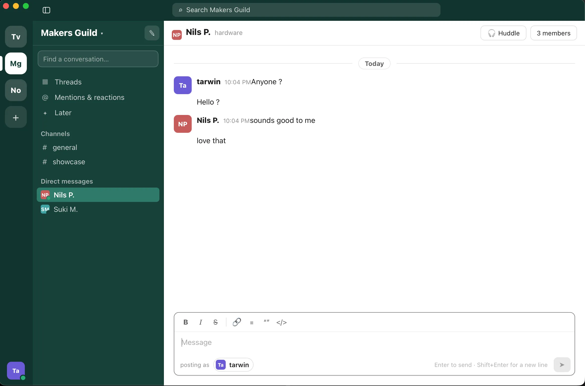

# TinySlaq 💬




**⬇ Download:** [tinyslaq-0.1.2.dmg](https://github.com/tarwin/tinyjsapp-examples/raw/main/_builds/tinyslaq-0.1.2.dmg) **(4.7 MB)** — prebuilt, signed & notarized; open and drag to Applications.

A Slack-style chat clone — a UI demo of how far one tinyjs window and a
SQLite file can go. (Not affiliated with Slack.)

Multiple colored **workspaces** and accounts, **channels and DMs**, messages
persisted in SQLite (`tjs:sqlite`), and a "post as" switcher so you can hold
both sides of a conversation. DMs get **canned auto-replies** pushed live over
the bridge a beat after you send — and if a reply lands in a channel you're
not looking at, a **desktop notification** tells you about it.

```sh
tinyjs dev      # run with hot reload
tinyjs build    # package dist/TinySlaq.app
```
